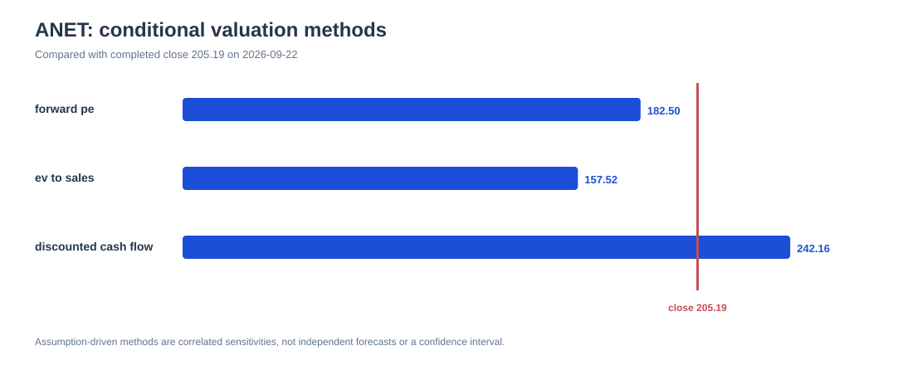
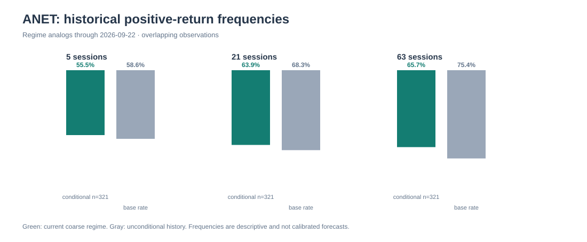
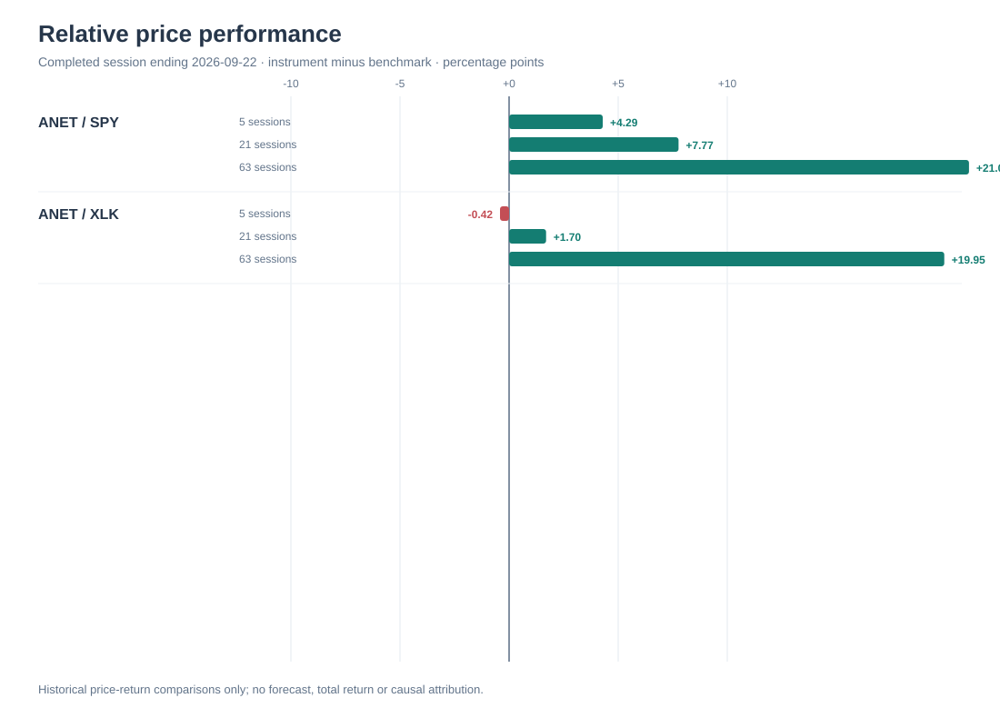
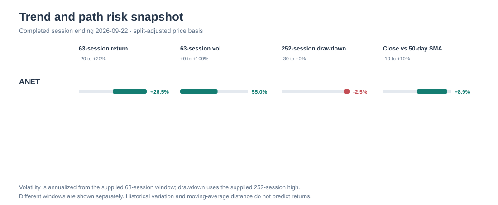
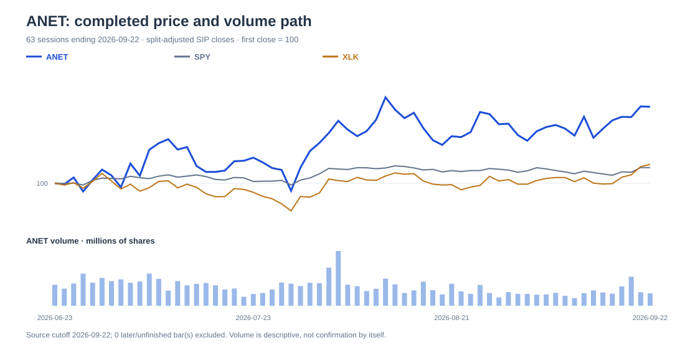

# ANET expert research — reviewed recovery report

**Status:** research draft, not published · evidence cutoff 2026-09-22 · recovered from the accepted Director draft after the second Challenger review timed out

## Decision view

**Watch / valuation-sensitive.** ANET has strong operating execution and medium-horizon price leadership, but the frozen $205.19 close requires demanding earnings or multiple assumptions. Two conditional valuation methods are below the close. The DCF is above it under aggressive long-duration growth assumptions. Historical analogs lean positive across 5/21/63 sessions, with wide downside tails and lower hit rates than their unconditional base rates.

## Valuation

| Method | Conditional value | Change vs $205.19 | Main assumptions |
|---|---:|---:|---|
| Forward P/E | $182.50 | -11.06% | FY2026 GAAP EPS $3.65 × 50x |
| EV/revenue | $157.52 | -23.23% | $12.5B revenue × 15x, plus $13.3433B assumed net cash, 1.275B shares |
| Five-year DCF | $242.16 | +18.02% | $5.4B starting FCF, 25% growth for five years, 8.5% discount rate, 4% terminal growth |

The range is **$157.52–$242.16**. It is a sensitivity range, not a confidence interval. About **85.7%** of DCF enterprise value is terminal value, making $242.16 especially sensitive to its long-run assumptions.

### EPS × P/E cases

| Case | FY2026 GAAP EPS | P/E | Value | Change |
|---|---:|---:|---:|---:|
| Bear | 3.35 | 40x | $134.00 | -34.69% |
| Base | 3.65 | 50x | $182.50 | -11.06% |
| Bull | 3.95 | 60x | $237.00 | +15.50% |

At base EPS of $3.65, break-even is **56.22x**. At 50x, break-even EPS is **$4.1038**. Bear loss exceeds bull gain by **19.19 percentage points**.

## Analyst snapshot

The archived Fox Business/FactSet page was last updated **Sep 22, 2026, 3:59 PM EDT**. It shows **34 ratings**, an average **BUY** recommendation, and an average target of **$249.966**, or **21.82%** above the frozen close.

| Consensus item | Mean | Low | High | Estimate count |
|---|---:|---:|---:|---:|
| Current quarter EPS | 1.08 | 1.06 | 1.11 | 26 |
| Next quarter EPS | 1.15 | 1.09 | 1.24 | 25 |
| Current fiscal EPS | 4.11 | 3.94 | 4.24 | 29 |
| Next fiscal EPS | 5.23 | 4.66 | 6.53 | 29 |

Recommendation distribution: **31 Buy, 2 Overweight, 1 Hold, 0 Underweight, 0 Sell**. Frozen price/current-fiscal consensus EPS is about **49.95x** and price/next-fiscal consensus EPS **39.25x**.

**Qualification:** the table does not state whether EPS is GAAP or non-GAAP, identify analysts, provide target dispersion, or explain methodology. Do not combine these EPS figures with the GAAP scenario grid. The original Director draft incorrectly called consensus unavailable; this report corrects that extraction error.

## Historical path probabilities

| Horizon | Conditional positive frequency | n | Median | p10 / p90 | Unconditional base rate |
|---:|---:|---:|---:|---:|---:|
| 5 sessions | 55.4517% | 321 | 0.4974% | -7.5762% / 6.7425% | 58.6207% (n=638) |
| 21 sessions | 63.8629% | 321 | 2.8939% | -12.6204% / 15.5652% | 68.3386% (n=638) |
| 63 sessions | 65.7321% | 321 | 10.6427% | -20.6472% / 36.7049% | 75.3918% (n=638) |

These are overlapping, dependent observations from one historical lookback under a coarse trend regime. They are descriptive analog frequencies, not calibrated forecasts.

## Technical state

ANET returned **+6.40%, +8.77%, and +26.50%** over 5/21/63 sessions. It led SPY by **+4.29, +7.77, and +21.08 points**. Versus XLK it **lagged by 0.42 point over 5 sessions**, then led by **+1.70 and +19.95 points** over 21/63 sessions. The mixed 5-session XLK sign is enforced by the validator.

## Drivers and scenario boundaries

### Upside drivers

- Q3 revenue near or above $3.3B, non-GAAP operating margin near 48%–49%, and evidence that AI Ethernet trials convert without acceptance delays.
- FY2026 GAAP EPS above $4.1038 at 50x, or cash flow evidence that supports the DCF bridge.
- Broader customer adoption that reduces risk from two customers representing 42% of 2025 revenue.
- Continued leadership versus SPY and XLK without a trend break.

### Downside drivers

- Customer capex pauses, acceptance delays, competition, or supply constraints that reduce revenue recognition and margin.
- Multiple compression after the September 2026 Fed hike; P/E and EV/revenue sensitivities are already below the close.
- Component, memory, silicon, logistics, or tariff pressure that cannot be passed through.
- A completed split-adjusted close below $195.506 before 2026-12-31, invalidating current short-term trend support pending recalculation.

## What would change the view

- **More constructive:** Q3 beat plus stronger Q4 outlook, FY2026 GAAP EPS above $4.1038, durable FCF evidence, and sustained relative leadership.
- **More cautious:** Q3 miss, weaker acceptance/order commentary, margin pressure, EPS below the base bridge, or a close below $195.506.
- **Revalue after full-year results:** replace provisional EPS, shares, net cash, revenue, and FCF assumptions and recompute all methods.

## Audit and limitations

- Arithmetic checks pass for scenario prices, forward P/E, EV/revenue equity bridge, and reverse thresholds.
- Direction checks pass: ANET led SPY in all three windows; against XLK it lagged at 5 sessions and led at 21/63.
- The initial Challenger completed and the Director dispositioned all four objections. The second Challenger review timed out without a receipt.
- Commodities was omitted when the reserve activated; filing evidence supports only an unquantified input and logistics channel.
- Optional FRED series timed out. Macro conclusions use the retrieved Fed release and market proxies.
- All valuation figures are assumption-driven sensitivities. The research remains unpublished.

## Evidence and system artifacts

- [Accepted Director draft](draft.md)
- [Expert arithmetic/sign audit](expert-audit.json)
- [Recovered analyst snapshot](analyst-consensus-extracted.json)
- [Three-method valuation evidence](evidence/1af20f2b2cb6abe05812a4b8957f8f8da5733e8b7b2570647f19009d910f45e1.json)
- [Scenario grid evidence](evidence/e6b3d9a2276c583a1600ca46302feb00373de371252185cde1303cdbd3ce1d60.json)
- [Probability panel evidence](evidence/f722984e74d9a0c7bb6dd13045430e3b93608ae5096fb7b36fa5ca9cd14c35ce.json)
- [Relative comparison evidence](evidence/e9f416fa396959f0c937268e00d56e7f14b7ec7b802181ca69ec141073bee191.json)
- [Archived analyst source evidence](evidence/0ef054dba249924555ec0dfc0eebcd7a2784219c855cd245e8a7e0346f50021c.json)

Generated from recorded evidence and the accepted Director draft. No trade was placed and nothing was published.
