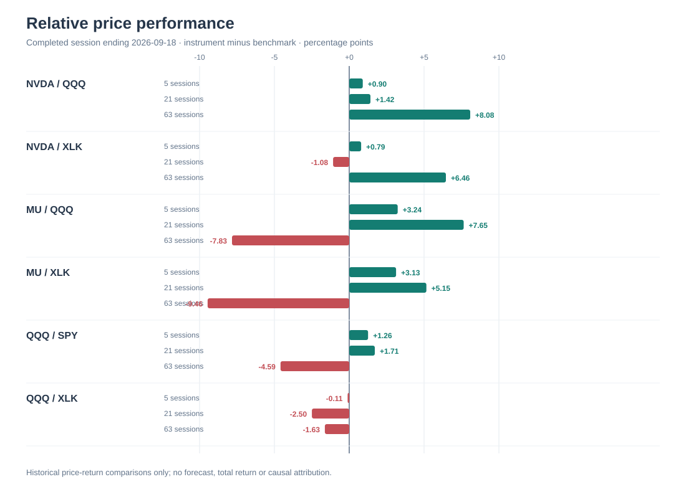
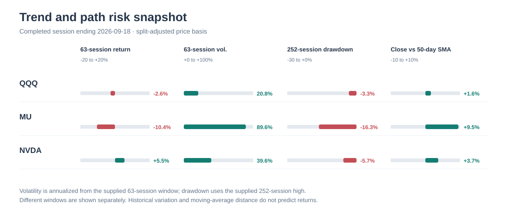
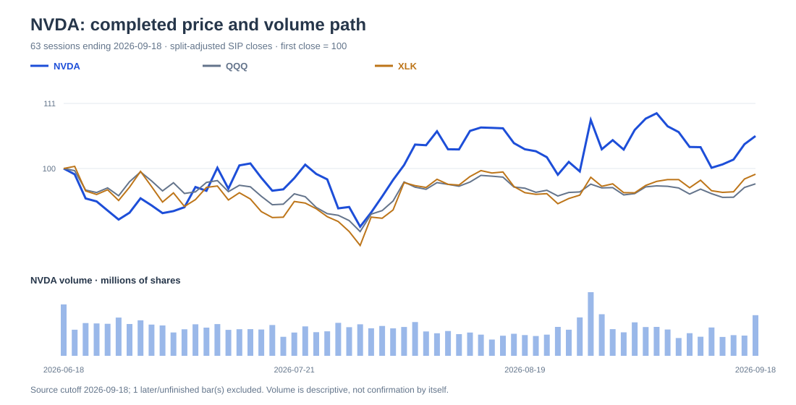
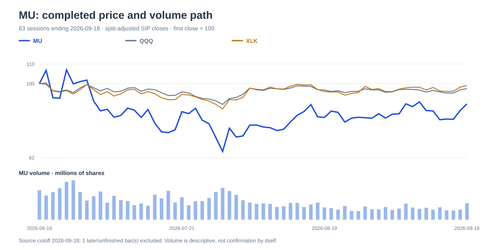
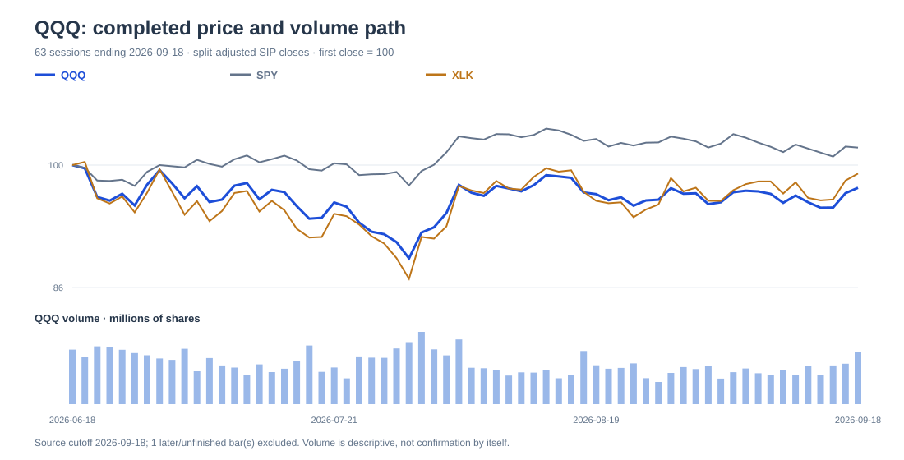

# Registered role development evaluation

Fixed archived evidence; unpublished and not current investment research.

Evidence cutoff: 2026-09-21T18:55:10.036012+00:00
Execution: EVALUATION_COMPLETE

## Technical

Task status: COMPLETE

Fixed evidence ends at the 2026-09-18 completed session; no later persistence test is possible. On the 63-session mandate, NVDA had positive absolute return and positive excess returns versus both QQQ and XLK. MU had a strong 5/21-session rebound but negative 63-session absolute and excess returns, with substantially greater path risk. QQQ’s price level was above major averages, yet its 63-session return and excess returns versus SPY and XLK were negative. These are technical observations, not valuation or fundamental recommendations.

Counter-case: NVDA’s mandate-horizon leadership could fail if its price trend breaks and recomputed 63-session excess turns negative. MU’s rebound could mature into genuine leadership if its currently negative 63-session excess versus QQQ and XLK turns positive. QQQ’s longer-window lag could reverse if its 63-session excess versus both SPY and XLK becomes positive. Later completed sessions are required to distinguish these paths.

### Deterministic technical charts

Comparison panel: [recorded evidence](evidence/c02274f1a0c948b33896e08d914f16f52ce3bd497308dacabe357cb0cca72382.json). Positive is instrument outperformance; negative is underperformance.

Price evidence: [QQQ](evidence/cfc10cc0e0a92b793ffba30251f39a4262161c92b5b7184d222baeda35b43503.json), [MU](evidence/dcffee9042af48d03c4547fb1cb5a2157bbfb8006c3cd2effcf59395fe8fcae9.json), [NVDA](evidence/8f28054cfc8983334d84a757fb4286b82436afcdab199ba7590f1a83528810bb.json).

The indexed paths use archived OHLCV only through the normalized completed close; later/unfinished bars are excluded. The summary comparison and risk charts use the same admitted cutoff. These are historical observations, not forecasts or executable quotes.

Claims:
- task-3-pairs: Matched SIP, split-adjusted price-return excess as of 2026-09-18: PAIR NVDA/QQQ 5=+0.9042 21=+1.4150 63=+8.0846
PAIR NVDA/XLK 5=+0.7949 21=-1.0806 63=+6.4574
PAIR MU/QQQ 5=+3.2378 21=+7.6478 63=-7.8341
PAIR MU/XLK 5=+3.1284 21=+5.1522 63=-9.4614
PAIR QQQ/SPY 5=+1.2592 21=+1.7082 63=-4.5904
PAIR QQQ/XLK 5=-0.1094 21=-2.4956 63=-1.6272 (c02274f1a0c948b33896e08d914f16f52ce3bd497308dacabe357cb0cca72382)
- task-3-relative-interpretation: NVDA outperformed QQQ at 5, 21 and 63 sessions. Against XLK, NVDA outperformed at 5 sessions, underperformed at 21, and outperformed at 63, so mandate-horizon leadership coexists with recent sector-relative softness. MU outperformed QQQ and XLK at 5 and 21 sessions but underperformed both at 63, identifying a rebound rather than established mandate-horizon leadership. QQQ outperformed SPY at 5 and 21 sessions but underperformed it at 63; versus XLK, QQQ underperformed at 5, 21 and 63 sessions. (c02274f1a0c948b33896e08d914f16f52ce3bd497308dacabe357cb0cca72382)
- task-3-nvda-facts: NVDA closed at 222.27 on 2026-09-18. Its 5/21/63-session returns were +1.8233%/+2.1649%/+5.4962%, and it was above its SMA20 of 218.8785, SMA50 of 214.2726 and SMA200 of 198.37815. The SMA20 fell 0.5832% over five sessions, and the close was 3.5119% below the prior 21-session closing high. Last-session volume was 1.5509 times the prior 20-session median, while recent five-session average volume was 1.0385 times that median. (8f28054cfc8983334d84a757fb4286b82436afcdab199ba7590f1a83528810bb, d34cf29ec1556aa431d3c2f42d58b888b88c7fdead8cb93ea82809bc2a7daeee)
- task-3-nvda-path: NVDA’s positive 63-session return, positive 63-session excess versus QQQ and XLK, and position above all three averages form the strongest continuation setup in this watchlist. The opposing path is near-term deterioration: the falling SMA20, price below the prior 21-session high, and negative 21-session excess versus XLK show that price-level strength and mandate-horizon leadership do not ensure current sector leadership. One elevated-volume session is not sustained breakout confirmation. (8f28054cfc8983334d84a757fb4286b82436afcdab199ba7590f1a83528810bb, c02274f1a0c948b33896e08d914f16f52ce3bd497308dacabe357cb0cca72382, d34cf29ec1556aa431d3c2f42d58b888b88c7fdead8cb93ea82809bc2a7daeee)
- task-3-nvda-risk: NVDA’s annualized realized volatility was 35.5569%, 44.7207% and 39.6344% over 5, 21 and 63 sessions. Maximum close-path drawdown within 63 sessions was 10.5835%, and the close was 5.7139% below the 252-session high. These describe observed path risk, not future probability or intrinsic value. (8f28054cfc8983334d84a757fb4286b82436afcdab199ba7590f1a83528810bb, d34cf29ec1556aa431d3c2f42d58b888b88c7fdead8cb93ea82809bc2a7daeee)
- task-3-mu-facts: MU closed at 1015.80 on 2026-09-18. Its 5/21/63-session returns were +4.1568%/+8.3977%/-10.4225%. It was above its SMA20 of 959.6005, SMA50 of 927.2569 and SMA200 of 640.146325, but the SMA20 fell 0.3330% over five sessions and price remained 1.1647% below the prior 21-session closing high. Last-session volume was 1.5321 times the prior 20-session median, while recent five-session average volume was 0.9772 times that median. (dcffee9042af48d03c4547fb1cb5a2157bbfb8006c3cd2effcf59395fe8fcae9, d34cf29ec1556aa431d3c2f42d58b888b88c7fdead8cb93ea82809bc2a7daeee)
- task-3-mu-path: MU’s positive 5- and 21-session returns and corresponding excess returns versus QQQ and XLK support a strong recent rebound. The negative 63-session return and negative 63-session excess versus both comparators show that the rebound has not repaired mandate-horizon leadership. Reclaiming the prior 21-session closing high with broader volume participation would strengthen continuation; loss of the frozen SMA50 while 63-session excess remains negative would favor relapse. (dcffee9042af48d03c4547fb1cb5a2157bbfb8006c3cd2effcf59395fe8fcae9, c02274f1a0c948b33896e08d914f16f52ce3bd497308dacabe357cb0cca72382, d34cf29ec1556aa431d3c2f42d58b888b88c7fdead8cb93ea82809bc2a7daeee)
- task-3-mu-risk: MU’s annualized realized volatility was 66.1162%, 52.4915% and 89.5585% over 5, 21 and 63 sessions. Its maximum 63-session close-path drawdown was 39.1048%, and it remained 16.2959% below the 252-session high. These observed risk measures were substantially larger than NVDA’s and QQQ’s, without implying an earnings-risk coefficient or forecast probability. (cfc10cc0e0a92b793ffba30251f39a4262161c92b5b7184d222baeda35b43503, dcffee9042af48d03c4547fb1cb5a2157bbfb8006c3cd2effcf59395fe8fcae9, 8f28054cfc8983334d84a757fb4286b82436afcdab199ba7590f1a83528810bb, d34cf29ec1556aa431d3c2f42d58b888b88c7fdead8cb93ea82809bc2a7daeee)
- task-3-qqq-facts: QQQ closed at 721.45 on 2026-09-18. Its 5/21/63-session returns were +0.9190%/+0.7499%/-2.5884%. It was above its SMA20 of 713.2355, SMA50 of 709.9512 and SMA200 of 662.59925 and closed 0.0471% above the prior 21-session closing high, although its SMA20 declined 0.3399% over five sessions. Last-session and recent five-session-average volume were 1.5181 and 1.2031 times the prior 20-session median. (cfc10cc0e0a92b793ffba30251f39a4262161c92b5b7184d222baeda35b43503, d34cf29ec1556aa431d3c2f42d58b888b88c7fdead8cb93ea82809bc2a7daeee)
- task-3-qqq-path: QQQ’s position above its averages and marginal move through the prior 21-session closing high support a constructive price-level case. That is not relative leadership: its 63-session return was negative, its 63-session excess versus SPY was negative, and its excess versus XLK was negative at 5, 21 and 63 sessions. Holding the frozen SMA50 while 63-session excess versus both comparators turns positive would improve the mandate-horizon interpretation; losing that level with persistent negative excess would weaken it. (cfc10cc0e0a92b793ffba30251f39a4262161c92b5b7184d222baeda35b43503, c02274f1a0c948b33896e08d914f16f52ce3bd497308dacabe357cb0cca72382, d34cf29ec1556aa431d3c2f42d58b888b88c7fdead8cb93ea82809bc2a7daeee)
- task-3-qqq-risk: QQQ’s annualized realized volatility was 16.3586%, 13.1945% and 20.8494% over 5, 21 and 63 sessions. Maximum 63-session close-path drawdown was 10.6519%, and the close was 3.3116% below the 252-session high. (cfc10cc0e0a92b793ffba30251f39a4262161c92b5b7184d222baeda35b43503, d34cf29ec1556aa431d3c2f42d58b888b88c7fdead8cb93ea82809bc2a7daeee)
- task-3-external-context: External diagnostics were mixed and are not watchlist breadth: SPY returned -0.3402%/-0.9583%/+2.0020%, IWM -1.6581%/-5.8399%/-3.8871%, and HYG -0.0891%/-1.4804%/-1.8498% over 5/21/63 sessions. These observations do not establish news causality. (3afbbdf6cc5c95b96b24b0d50d589a9593e9008fa098a2f734f06499b7a2c2c2, 365e083a28d5b3be465afa5cd301959ecdcc4fc4d2387e4bfa0885589ad9b586, f172de4fe8ce1fbf8538ad78e65abddb4f085528521e2845e7cc2c267309c4da)

Review conditions:
- Completed-close review: NVDA below 214.2726 (split_adjusted); expires 2026-12-18T23:59:59+00:00; evidence dates: 2026-09-18 / retrieved 2026-09-21T18:54:16.067761+00:00. A completed NVDA close below the frozen 2026-09-18 SMA50 of 214.2726 would weaken the constructive medium-term price-level setup and shift interpretation toward trend deterioration; this is a research checkpoint, not an order or future moving average. — not an executable order.
- Human review: Recompute NVDA’s matched 21- and 63-session excess returns versus QQQ and XLK after additional completed sessions. Positive excess at both windows versus both comparators would confirm broadening leadership; negative excess at both windows versus both would invalidate the present leadership interpretation.
- Completed-close review: MU below 927.2569 (split_adjusted); expires 2026-12-18T23:59:59+00:00; evidence dates: 2026-09-18 / retrieved 2026-09-21T18:54:15.222111+00:00. A completed MU close below the frozen 2026-09-18 SMA50 of 927.2569 would weaken the rebound setup and increase the relevance of its negative 63-session trend and deep drawdown; this is a research checkpoint, not an order or dynamic-average test. — not an executable order.
- Human review: Recompute MU’s matched 63-session excess returns versus QQQ and XLK after additional completed sessions. Positive signs versus both would upgrade the move from rebound to mandate-horizon leadership; continued negative signs versus both would preserve the rebound-only interpretation.
- Completed-close review: QQQ below 709.9512 (split_adjusted); expires 2026-12-18T23:59:59+00:00; evidence dates: 2026-09-18 / retrieved 2026-09-21T18:54:14.468335+00:00. A completed QQQ close below the frozen 2026-09-18 SMA50 of 709.9512 would weaken its constructive price-level setup and make the negative 63-session return more consequential; this is a research checkpoint, not an order or future-average estimate. — not an executable order.
- Human review: Recompute QQQ’s matched 63-session excess returns versus SPY and XLK after additional completed sessions. Positive signs versus both would confirm restored mandate-horizon leadership; continued negative signs versus both would confirm that price-level strength has not translated into relative leadership.

Gaps:
[
  {
    "description": "No completed-session observations after 2026-09-18 are available. Persistence above frozen averages, sustained volume confirmation and subsequent relative-return sign changes therefore cannot be observed; this limits conviction but does not invalidate the dated technical comparison.",
    "critical": false,
    "symbols": [
      "NVDA",
      "MU",
      "QQQ"
    ],
    "dimensions": [
      "market_behavior"
    ]
  }
]

Objections:
[]

Dispositions:
[]

## Validated numerical evidence

Values below come directly from stored evidence. Open each source for full lineage and fields.

