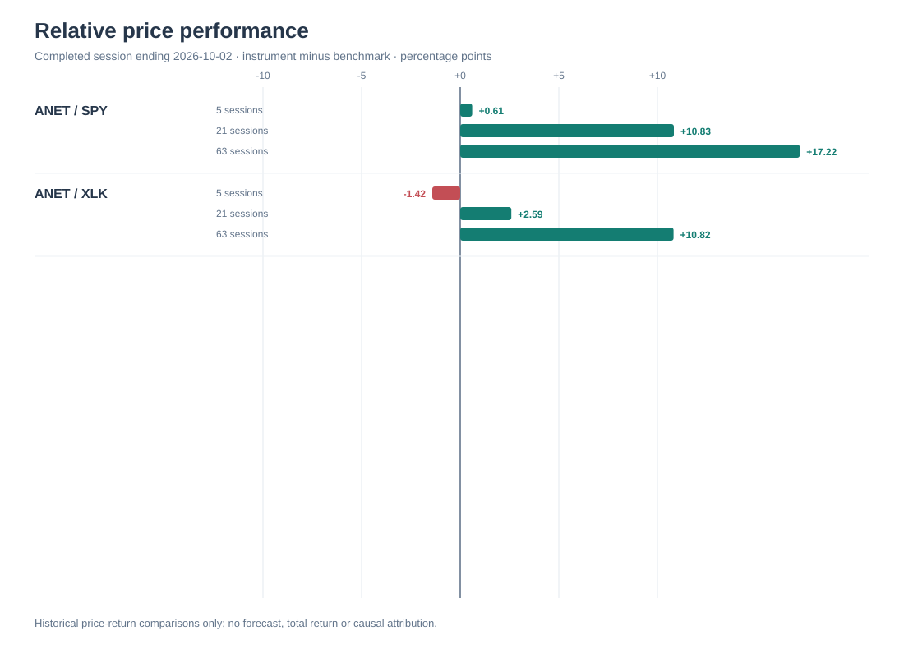
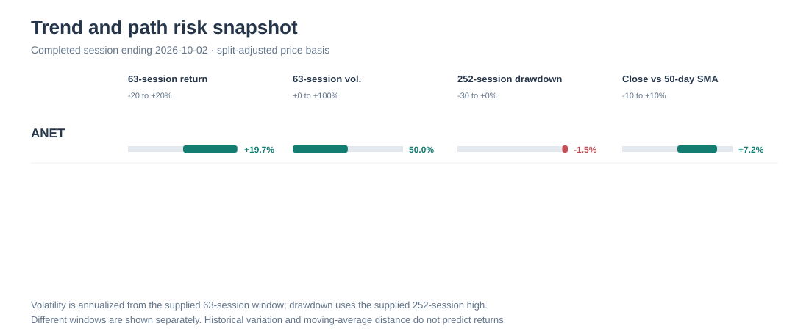
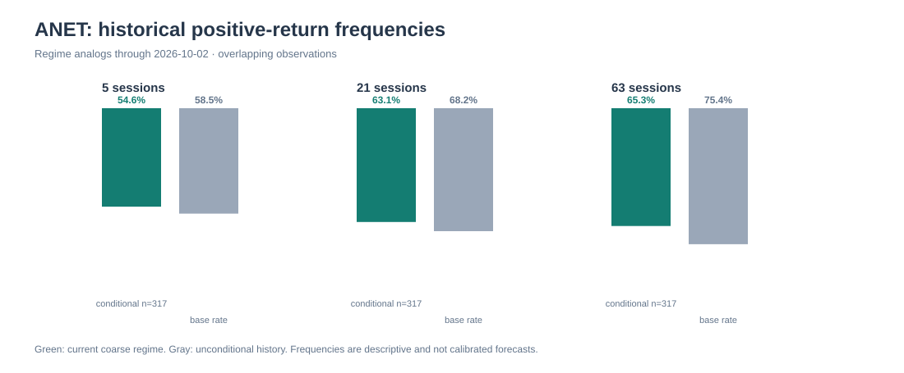
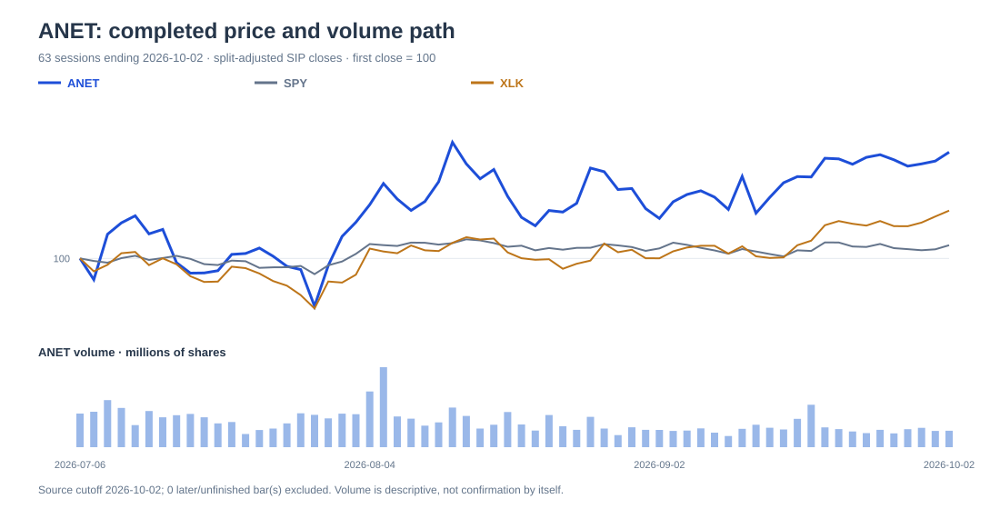

# Watchlist research

NOT PUBLISHED · no observation issued

Final research draft: ANET is a watch over 5, 21 and 63 sessions. Reported operating momentum and 21/63-session relative leadership are constructive, but forward valuation is a stipulated sensitivity rather than an observed forecast, while customer concentration, supply/trade costs, rates and a volatile/extended price path limit a favorable short-horizon preference.

## ANET — watch

Strong reported AI/data-center networking momentum and 21/63-session relative leadership warrant attention, but concentrated deployment timing, unmeasured policy/supply costs, mixed macro conditions and a volatile extended price path support watch rather than a favorable 5/21/63-session preference.

Counter-case: AI-networking execution could exceed the base earnings bridge and sustain a higher multiple; alternatively, customer timing, margin pressure and multiple compression could coincide.

Valuation: Fiscal period: FY2026, 2026-01-01 to 2026-12-31; US-GAAP diluted EPS; split-adjusted scenario share basis. H1 reported GAAP diluted EPS was $1.75. Bear/base/bull assume FY2026 EPS of $3.15/$3.55/$3.85, leaving H2 residual EPS of $1.40/$1.80/$2.10 under a constant-share approximation. Q3 guidance of $1.06–$1.08 is non-GAAP and cannot be added to these GAAP values. With explicit 50x/58x/66x P-E assumptions, the sensitivity is $157.50 (-24.04%), $205.90 (-0.70%), and $254.10 (+22.55%) versus the $207.35 completed close. For base, holding EPS fixed at $3.55 requires a 58.40845x break-even P-E; holding P-E fixed at 58x requires $3.575 break-even EPS. Earnings and multiple can weaken jointly. Bull gain of 22.55% is 1.50 percentage points smaller than the 24.04% absolute bear loss, but that descriptive property of stipulated annual cases is not used to rank 5/21/63-session outcomes. Mechanical price/FY2025 GAAP EPS is 75.4x, only a trailing reference.

Business — supported
Reported growth, profitability and Q3 revenue context support an active AI/networking operating backdrop.
Qualification: Durability depends on deployment conversion; concentration and order/acceptance timing can create material variability, and non-GAAP guidance is not GAAP earnings.

Valuation — conditional
The completed sensitivity maps stated EPS/P-E combinations around the dated close but does not establish fair value or a short-horizon expected return.
Qualification: Forward EPS and P-E are unweighted assumptions, with no observed forward multiple, consensus, or GAAP reconciliation.

Market Behavior — supported
ANET has 21/63-session leadership versus SPY and XLK, alongside five-session XLK lag, high reported realized volatility and a meaningful 63-session drawdown.
Qualification: Data end October 2; historical regime results are overlapping descriptive samples and not forecasts or current executable prices.

Policy Exposure — conditional
Supply constraints, tariffs and trade restrictions are plausible indirect fulfillment and margin risks.
Qualification: Direct China/rule applicability and financial sensitivity are unquantified, so no direct policy effect is asserted.

Relative Preference — conditional
Watch rather than favorable near-term preference: medium-term leadership is offset by near-term relative cooling, path risk and conditional valuation/macro sensitivity.
Qualification: This does not use hypothetical annual grid asymmetry as a 5/21/63-session ranking signal and is not a comparison of intrinsic value versus SPY or XLK.

### Overall assessment

ANET is a conditional watch across 5, 21 and 63 sessions. Business momentum and medium-term leadership are constructive; valuation remains assumption-driven and execution, rate and supply risks can affect both earnings and the multiple.

### Global forces

- AI/cloud deployment conversion: Trials, acceptance periods and deployment plans determine when demand becomes recognized revenue. Consequence: Sustained conversion supports earnings; delays can create sharp quarterly variability given concentrated customers. (evidence: ee8a3f12a80fe9e9e4ec08ca7acc7bc4168735c14f4afb1441d72ca4cfcfbc3e, c50fcfc651e3386a8dfdd68403bd5799fd9e4cc91c75642b9231f4805bd4e8de)
- Rates and risk appetite: Higher long rates can reset equity multiples before a later customer-order effect. Consequence: Multiple compression can offset operating strength over short horizons. (evidence: 11b42cf5296d11a9e499b96b7b011253c1290446831777210046d35f82acdeb9, 138c8d5f1064729a486c5ec7df9b46768ff563647764172154f8a12527cfd43d, a40b5d034f94ceb6f0b5aa7f28028d311a30c1a7739899fcd722b5720a23f7ec)
- Trade, supply and input availability: Limited supplier reliance, outsourced manufacturing and purchase commitments link component availability and tariffs to cost and shipment timing. Consequence: A disruption could pressure margin or recognized revenue; magnitude is unknown. (evidence: e5a141de821d41410a7f203ee3aa31f59b8e260d5a91d4c757d1ad3c36fdecfd, c50fcfc651e3386a8dfdd68403bd5799fd9e4cc91c75642b9231f4805bd4e8de, c9ecd251cb35fa1c31328d0850cd3087892984408e53b710d74d5735453e0ed7)
- Extended technical path: Medium-term relative leadership coexists with high realized volatility, a material interim drawdown and recent XLK-relative lag. Consequence: The five-session path may reverse despite intact 21/63-session leadership. (evidence: cab3dbd599fba8074bb1b2491694d8114fdc5ba12410d8e4ef149c3c634cdb2f, 6c363b7b9c1c1c9c48f4cf00b00bf3f9f7d144518ed17825650e7bf00aef93a3, ccb2933840881d10497d8953eec1ab8fc2b120359ef8d3382d466064ca6b17b2)

### Conditional outcomes

- bear: If Order/acceptance delays or supply-cost pressure reduce the H2 GAAP bridge while the market de-rates the shares. → The stipulated $3.15 EPS/50x sensitivity is $157.50, -24.04% from the October 2 close. Plausibility: Customer concentration, acceptance timing, supply/tariff mechanisms, higher rates and observed volatility make this a coherent conditional outcome, not a probability. (evidence: a5e98c6f3e81f688c2ca758f7b6d357b564233b138e2754c1df64b6157d9a202, ee8a3f12a80fe9e9e4ec08ca7acc7bc4168735c14f4afb1441d72ca4cfcfbc3e, c50fcfc651e3386a8dfdd68403bd5799fd9e4cc91c75642b9231f4805bd4e8de)
- base: If Demand converts broadly in line with Q3 revenue context, while the assumed $3.55 GAAP EPS and 58x multiple remain unchanged. → The stipulated value is $205.90, -0.70% from the October 2 close; operating delivery alone does not ensure price appreciation. Plausibility: Q2/H1 results and Q3 revenue context support continued demand, but Q3 earnings guidance is non-GAAP and macro signals remain mixed. The base is not probability-ranked. (evidence: 4060e40ec9db14e3ba35ca64820f4e5937290da2448b6ccfae43a49482579676, 883b25fa15cde65b15525540fe2e73e2f10638d87bafc3c3acb38067997984ef, a5e98c6f3e81f688c2ca758f7b6d357b564233b138e2754c1df64b6157d9a202)
- bull: If AI/networking conversion exceeds the base H2 residual and the market accepts the stipulated 66x multiple while leadership persists. → The stipulated $3.85 EPS/66x sensitivity is $254.10, +22.55% from the October 2 close. Plausibility: Reported growth and AI-platform activity make the mechanism possible, not probable; the annual sensitivity does not map directly to requested short horizons. (evidence: 883b25fa15cde65b15525540fe2e73e2f10638d87bafc3c3acb38067997984ef, a5e98c6f3e81f688c2ca758f7b6d357b564233b138e2754c1df64b6157d9a202, ee8a3f12a80fe9e9e4ec08ca7acc7bc4168735c14f4afb1441d72ca4cfcfbc3e)

### What to consider

For 5 sessions, prioritize completed-session trend confirmation rather than stale single-venue IEX observations. For 21 sessions, test whether ANET restores XLK-relative leadership and whether yields and order commentary stabilize. For 63 sessions, reassess after GAAP results show whether the H2 earnings bridge, order conversion and margin assumptions are holding. The tradeoff is participation in continued AI-networking execution versus a volatile reversal if earnings and P-E compress together.

### Short summary

Operating and medium-term market evidence are constructive, but valuation is conditional and short-horizon path risk remains high. Evidence of GAAP conversion, trend support and measurable supply/trade impact would change the view.

Assumptions:
- Use the October 2, 2026 split-adjusted SIP completed close of $207.35 rather than IEX as the anchor.
- FY2026 EPS/P-E inputs are unweighted US-GAAP constant-share sensitivity assumptions.
- Technical analog frequencies are descriptive dependent samples, not forecasts.

Review conditions:
- Completed-close review: ANET below 199.845 (split_adjusted); expires 2026-11-02T23:59:59Z; evidence dates: 2026-10-02 / retrieved 2026-10-04T04:38:52.992166+00:00. A completed split-adjusted close below $199.845 by 2026-11-02 weakens trend support and triggers reassessment. — not an executable order.
- Human review: Review the next results for GAAP evidence against the base earnings bridge and for changes in order acceptance or margin.

Claims:
- fact: ANET reported Q2 2026 revenue of $3.036bn, up 37.7% year over year, GAAP operating margin of 45.4%, GAAP diluted EPS of $0.95, and H1 GAAP diluted EPS of $1.75. Its Q3 outlook was about $3.3bn revenue, 48%–49% non-GAAP operating margin, and $1.06–$1.08 non-GAAP diluted EPS; those forward non-GAAP measures cannot be directly combined with GAAP EPS. ([6c75ed473ad7](evidence/6c75ed473ad7949ac493716a9a45bba1379584d74fabe362e7515d40d900aacf.json), [4060e40ec9db](evidence/4060e40ec9db14e3ba35ca64820f4e5937290da2448b6ccfae43a49482579676.json), [883b25fa15cd](evidence/883b25fa15cde65b15525540fe2e73e2f10638d87bafc3c3acb38067997984ef.json))
- inference: AI/networking demand can support continued growth, but the earnings path is conditional: two end customers represented 16% and 26% of FY2025 revenue, and the filing identifies customer capex cycles, trials, acceptance periods, deployment timing and discounts as sources of revenue and margin variability. ([ee8a3f12a80f](evidence/ee8a3f12a80fe9e9e4ec08ca7acc7bc4168735c14f4afb1441d72ca4cfcfbc3e.json), [c50fcfc651e3](evidence/c50fcfc651e3386a8dfdd68403bd5799fd9e4cc91c75642b9231f4805bd4e8de.json))
- scenario: The explicit FY2026 US-GAAP EPS/P-E sensitivity produces $157.50/-24.04%, $205.90/-0.70%, and $254.10/+22.55% in bear/base/bull from the October 2 completed close, using unweighted $3.15/$3.55/$3.85 EPS and 50x/58x/66x P-E assumptions. This is a valuation sensitivity, not a forecast, probability, observed multiple, fair value, or short-horizon risk/reward ranking. ([f48dc8a88360](evidence/f48dc8a88360870fdc99f9b8d20d9aa946810c0f0df1395b55eb46f610e28085.json), [a5e98c6f3e81](evidence/a5e98c6f3e81f688c2ca758f7b6d357b564233b138e2754c1df64b6157d9a202.json))
- fact: At the split-adjusted October 2, 2026 SIP completed close of $207.35, ANET returned +0.39%, +11.42% and +19.66% over 5/21/63 sessions; it exceeded SPY by +0.61, +10.83 and +17.22 percentage points, and lagged/led XLK by -1.42/+2.59/+10.82 points. The panel reports 63-session realized volatility of 49.9571% (methodology does not establish annualization), and the 63-session path had a 15.5060% maximum close drawdown. ([f48dc8a88360](evidence/f48dc8a88360870fdc99f9b8d20d9aa946810c0f0df1395b55eb46f610e28085.json), [cab3dbd599fb](evidence/cab3dbd599fba8074bb1b2491694d8114fdc5ba12410d8e4ef149c3c634cdb2f.json), [6c363b7b9c1c](evidence/6c363b7b9c1c1c9c48f4cf00b00bf3f9f7d144518ed17825650e7bf00aef93a3.json))
- inference: The macro backdrop is mixed for a high-multiple technology stock: the 10-year Treasury yield was 5.24% on October 1 while IWM and HYG had negative 21-session returns, even as XLK was positive. Higher rates can pressure the assumed P-E before any later customer-order effect, but ANET-specific rate elasticity is unmeasured. ([fa430ba7e808](evidence/fa430ba7e8086379459e4ea58f8575eca6845dfdd9d64b0ab2e1bca588c547d6.json), [11b42cf5296d](evidence/11b42cf5296d11a9e499b96b7b011253c1290446831777210046d35f82acdeb9.json), [138c8d5f1064](evidence/138c8d5f1064729a486c5ec7df9b46768ff563647764172154f8a12527cfd43d.json), [a40b5d034f94](evidence/a40b5d034f94ceb6f0b5aa7f28028d311a30c1a7739899fcd722b5720a23f7ec.json))
- inference: Trade, component and commodity-related exposure is an indirect fulfillment/margin risk rather than a measured direct oil or export-control input: ANET relies on limited suppliers including Broadcom, outsources manufacturing, and had $9.7bn of non-cancellable purchase commitments at June 30, 2026. Constraints, tariffs or logistics disruption could affect cost and delivery timing, but magnitude and direct China exposure are unquantified. ([e5a141de821d](evidence/e5a141de821d41410a7f203ee3aa31f59b8e260d5a91d4c757d1ad3c36fdecfd.json), [c50fcfc651e3](evidence/c50fcfc651e3386a8dfdd68403bd5799fd9e4cc91c75642b9231f4805bd4e8de.json), [c9ecd251cb35](evidence/c9ecd251cb35fa1c31328d0850cd3087892984408e53b710d74d5735453e0ed7.json))
- inference: A watch stance is supported rather than a favorable near-term preference: medium-term ANET leadership versus SPY and XLK is counterbalanced by five-session XLK lag, high realized volatility, a material interim drawdown, and unmeasured macro/order sensitivity. The annual valuation grid is retained only as an unranked sensitivity and does not determine this 5/21/63-session conclusion. ([cab3dbd599fb](evidence/cab3dbd599fba8074bb1b2491694d8114fdc5ba12410d8e4ef149c3c634cdb2f.json), [6c363b7b9c1c](evidence/6c363b7b9c1c1c9c48f4cf00b00bf3f9f7d144518ed17825650e7bf00aef93a3.json), [ccb293384088](evidence/ccb2933840881d10497d8953eec1ab8fc2b120359ef8d3382d466064ca6b17b2.json), [a5e98c6f3e81](evidence/a5e98c6f3e81f688c2ca758f7b6d357b564233b138e2754c1df64b6157d9a202.json))

## Shared exposures

## Role coverage

- company: completed — Completed operating, concentration and GAAP-to-sensitivity bridge assessment.
- macro: completed — Completed rates, cross-asset proxy and order-transmission assessment.
- technical: completed — Completed dated price-path, relative-strength and qualified analog assessment.
- geopolitics: completed — Completed trade-rule applicability limitation and supply-chain exposure assessment.
- commodities: completed — Completed component-input/commitment channel assessment; no unsupported direct commodity inference.

## Evidence gaps

- ANET: No observed forward P-E, consensus estimate, or forward GAAP reconciliation to Q3 non-GAAP guidance is available. This prevents an unconditional valuation or fair-value conclusion, but not the explicitly hypothetical sensitivity.
- ANET: ANET-specific China demand, manufacturing geography, tariff cost, rule applicability and policy financial sensitivity are unquantified. The available BIS rule is dated and does not establish applicability to ANET.
- ANET: There is no post-October 2 completed session or current consolidated executable quote. The IEX snapshot is market-closed and single venue; historical technical frequencies overlap and are not calibrated forecasts.

## Question effects

- question-1 / changed: The October 1 10-year yield observation supports a qualified multiple-first macro channel, while issuer-specific rate elasticity remains unknown.
- question-2 / changed: The company disclosure quantifies customer concentration and identifies ordering, trials, acceptance and deployment timing as issuer-specific demand mechanisms.
- question-3 / unresolved: Event attribution was declined; the split-adjusted series supports dated technical description but does not establish that no issuer event affected the path.

## Challenge dispositions

- task-1-o1 / changed: The final retains a deterministic valuation sensitivity and does not infer favorable near-term risk/reward from operating growth. Market-path risk remains explicit.
- task-1-o2 / changed: The final explicitly preserves the GAAP/non-GAAP distinction; Q3 guidance is demand/margin context only and is not added to GAAP EPS.
- task-1-o3 / unresolved: No evidence establishes ANET product coverage, licensing outcome, China exposure, or policy-specific financial impact. Policy remains an indirect conditional channel only.
- task-10-o1 / changed: The final removes the stipulated annual grid asymmetry from the 5/21/63-session preference rationale. The grid is described solely as an unranked FY2026 sensitivity.
- task-10-o2 / changed: The final reports the panel's 49.9571% realized-volatility figure without calling it annualized.

## Limitations

- Unpublished research; publication refresh, conditions evaluation and outcome scoring belong to M3.
- Market context uses only the frozen benchmark list; watchlist diagnostics are not market breadth.
- Source dates and missingness remain explicit. Scenario valuations are assumptions, not price targets or calibrated forecasts.
- Catalog cost is estimated; provider output-token and cost ceilings may be enforced after a response.

### Deterministic technical charts

Comparison panel: [recorded evidence](evidence/cab3dbd599fba8074bb1b2491694d8114fdc5ba12410d8e4ef149c3c634cdb2f.json). Positive is instrument outperformance; negative is underperformance.

Price evidence: [ANET](evidence/f48dc8a88360870fdc99f9b8d20d9aa946810c0f0df1395b55eb46f610e28085.json).

Historical overlapping forward-return frequencies conditional on three coarse price-regime signs. Samples are dependent, selected from one finite lookback, and are not calibrated probabilities, causal estimates, or guarantees. Report sample size and unconditional base rate alongside them.

The indexed paths use archived OHLCV only through the normalized completed close; later/unfinished bars are excluded. The summary comparison and risk charts use the same admitted cutoff. These are historical observations, not forecasts or executable quotes.

## Validated numerical evidence

Values below come directly from stored evidence. Open each source for full lineage and fields.

### [sec-submissions-ANET](evidence/fc2e43df3d8fb01ce0494d6e31e2856e7791577befe59b752e7c873d8a86e461.json)

Full normalized fields are available through the evidence link.

### [sec-facts-ANET](evidence/6c75ed473ad7949ac493716a9a45bba1379584d74fabe362e7515d40d900aacf.json)

| Metric | Value | Unit | Period start | Period end | Filed |
|---|---:|---|---|---|---|
| revenue (RevenueFromContractWithCustomerExcludingAssessedTax) | 5744700000 | USD | 2026-01-01 | 2026-06-30 | 2026-08-05 |
| net_income (NetIncomeLoss) | 2235800000 | USD | 2026-01-01 | 2026-06-30 | 2026-08-05 |
| operating_income (OperatingIncomeLoss) | 2535800000 | USD | 2026-01-01 | 2026-06-30 | 2026-08-05 |
| operating_cash_flow (NetCashProvidedByUsedInOperatingActivities) | 2776500000 | USD | 2026-01-01 | 2026-06-30 | 2026-08-05 |
| capital_expenditure (PaymentsToAcquirePropertyPlantAndEquipment) | 84200000 | USD | 2026-01-01 | 2026-06-30 | 2026-08-05 |
| assets (Assets) | 23720100000 | USD | instant | 2026-06-30 | 2026-08-05 |
| liabilities (Liabilities) | 8922400000 | USD | instant | 2026-06-30 | 2026-08-05 |
| equity (StockholdersEquity) | 14797700000 | USD | instant | 2026-06-30 | 2026-08-05 |
| cash (CashAndCashEquivalentsAtCarryingValue) | 2290200000 | USD | instant | 2026-06-30 | 2026-08-05 |
| diluted_eps (EarningsPerShareDiluted) | 1.75 | USD/shares | 2026-01-01 | 2026-06-30 | 2026-08-05 |
| shares_outstanding (CommonStockSharesOutstanding) | 1261200000 | shares | instant | 2026-06-30 | 2026-08-05 |
| annual diluted EPS anchor | 2.75 | USD/shares | 2025-01-01 | 2025-12-31 | 2026-02-17 |
| annual diluted EPS anchor | 2.23 | USD/shares | 2024-01-01 | 2024-12-31 | 2026-02-17 |
| annual diluted EPS anchor | 1.65 | USD/shares | 2023-01-01 | 2023-12-31 | 2026-02-17 |

Fiscal durations are not silently annualized; debt concepts may cover only current maturities.

### [price-ANET](evidence/f48dc8a88360870fdc99f9b8d20d9aa946810c0f0df1395b55eb46f610e28085.json)

ANET · 2026-10-02 · FRESH · sip · split_adjusted · price return

| Metric | Recorded value |
|---|---:|
| latest_close | 207.35 |
| sma20 | 199.845 |
| sma50 | 193.4168 |
| sma200 | 158.91795000000002 |
| rsi14_simple | 81.41479099678456 |
| return5_pct | 0.38731541999514896 |
| return21_pct | 11.418592154755514 |
| return63_pct | 19.661819021237292 |
| realized_vol63_pct | 49.957126544400126 |

### [price-SPY](evidence/ed6bb3877b76fe93164f0403af8522b8dd97a42b3fafde57e37dd001f26ec1ce.json)

SPY · 2026-10-02 · FRESH · sip · split_adjusted · price return

| Metric | Recorded value |
|---|---:|
| latest_close | 769.64 |
| sma20 | 764.8285 |
| sma50 | 763.7021999999998 |
| sma200 | 720.471 |
| rsi14_simple | 58.063328424153134 |
| return5_pct | -0.22168924612692154 |
| return21_pct | 0.5854984578388844 |
| return63_pct | 2.443829198168457 |
| realized_vol63_pct | 11.003568230609359 |

### [price-XLK](evidence/fa430ba7e8086379459e4ea58f8575eca6845dfdd9d64b0ab2e1bca588c547d6.json)

XLK · 2026-10-02 · FRESH · sip · split_adjusted · price return

| Metric | Recorded value |
|---|---:|
| latest_close | 199.81 |
| sma20 | 191.26799999999997 |
| sma50 | 186.30219999999997 |
| sma200 | 164.94025000000002 |
| rsi14_simple | 83.36914482165878 |
| return5_pct | 1.8036378458246238 |
| return21_pct | 8.828976034858393 |
| return63_pct | 8.846761453396535 |
| realized_vol63_pct | 25.813718764085717 |

### [price-IWM](evidence/11b42cf5296d11a9e499b96b7b011253c1290446831777210046d35f82acdeb9.json)

IWM · 2026-10-02 · FRESH · sip · split_adjusted · price return

| Metric | Recorded value |
|---|---:|
| latest_close | 281.52 |
| sma20 | 285.01050000000004 |
| sma50 | 292.57660000000004 |
| sma200 | 276.32 |
| rsi14_simple | 36.41003828158218 |
| return5_pct | -0.15959144589852148 |
| return21_pct | -4.2481548246658285 |
| return63_pct | -5.814653730344599 |
| realized_vol63_pct | 13.302869011351902 |

### [price-HYG](evidence/138c8d5f1064729a486c5ec7df9b46768ff563647764172154f8a12527cfd43d.json)

HYG · 2026-10-02 · FRESH · sip · split_adjusted · price return

| Metric | Recorded value |
|---|---:|
| latest_close | 76.91 |
| sma20 | 78.20900000000002 |
| sma50 | 79.00439999999999 |
| sma200 | 79.88575 |
| rsi14_simple | 19.083969465648835 |
| return5_pct | -1.2201387105060357 |
| return21_pct | -2.7809379345215546 |
| return63_pct | -3.706022286215105 |
| realized_vol63_pct | 3.618912741128176 |

### [fred-DGS10](evidence/a40b5d034f94ceb6f0b5aa7f28028d311a30c1a7739899fcd722b5720a23f7ec.json)

Full normalized fields are available through the evidence link.

### [fred-DFF](evidence/27e7872161aded3ec8c7dfef0316dd8aa213383066837803c437a078ae9d6407.json)

Full normalized fields are available through the evidence link.

### [price-EEM](evidence/faf78acdb97645658f22e90b76d072028ad83d0bd17bd909c3e9c1c1011d1a81.json)

EEM · 2026-10-02 · FRESH · sip · split_adjusted · price return

| Metric | Recorded value |
|---|---:|
| latest_close | 67.67 |
| sma20 | 67.45 |
| sma50 | 66.4062 |
| sma200 | 62.99459999999999 |
| rsi14_simple | 59.65517241379315 |
| return5_pct | -0.4560164754339513 |
| return21_pct | 0.7743857036485391 |
| return63_pct | 0.14799467219182016 |
| realized_vol63_pct | 23.810079464291785 |

### [price-EFA](evidence/afdc49994981cb4d4e35c989668b10917272177a73fbb2dc1851f743f8500b4b.json)

EFA · 2026-10-02 · FRESH · sip · split_adjusted · price return

| Metric | Recorded value |
|---|---:|
| latest_close | 103.96 |
| sma20 | 105.50250000000001 |
| sma50 | 106.48179999999998 |
| sma200 | 102.5934 |
| rsi14_simple | 41.70324846356455 |
| return5_pct | -1.5157256536566965 |
| return21_pct | -2.895572576125549 |
| return63_pct | -1.4223402237815264 |
| realized_vol63_pct | 12.973522482614543 |

### [price-GLD](evidence/563e4b0324abf58b845eb436c00a4c20c2d238bcf73476c74f11d7b2a906cf2d.json)

GLD · 2026-10-02 · FRESH · sip · split_adjusted · price return

| Metric | Recorded value |
|---|---:|
| latest_close | 380.14 |
| sma20 | 393.21000000000004 |
| sma50 | 396.2926 |
| sma200 | 416.1553 |
| rsi14_simple | 38.412408759124105 |
| return5_pct | -3.3730713504994903 |
| return21_pct | -5.620934505188934 |
| return63_pct | -0.5207651846230399 |
| realized_vol63_pct | 24.520184041141334 |

### [price-USO](evidence/5c530135d4878fa48ccb9568b9e0f7283b1fe1260cca34c3d301c1ddce4906bd.json)

USO · 2026-10-02 · FRESH · sip · split_adjusted · price return

| Metric | Recorded value |
|---|---:|
| latest_close | 147.37 |
| sma20 | 150.69799999999998 |
| sma50 | 137.367 |
| sma200 | 115.17275000000001 |
| rsi14_simple | 41.462966366476756 |
| return5_pct | -0.6472055551810185 |
| return21_pct | 4.406659582004968 |
| return63_pct | 41.22664111164352 |
| realized_vol63_pct | 52.26962981867283 |

### [price-UUP](evidence/b109e68b8ad34b329ab7a3cf197fe16aa3920701b952fdebab286e27c097f2ed.json)

UUP · 2026-10-02 · FRESH · sip · split_adjusted · price return

| Metric | Recorded value |
|---|---:|
| latest_close | 28.89 |
| sma20 | 28.434999999999995 |
| sma50 | 28.264 |
| sma200 | 27.755 |
| rsi14_simple | 84.61538461538458 |
| return5_pct | 0.943396226415083 |
| return21_pct | 2.555910543130979 |
| return63_pct | 2.012711864406791 |
| realized_vol63_pct | 5.19374796161255 |

### [snapshot-ANET](evidence/aa6568e4643cdd3054e63738d2759fda750dd8bc536ebc62c249a46a42e0702d.json)

Full normalized fields are available through the evidence link.

### [cab3dbd599fb](evidence/cab3dbd599fba8074bb1b2491694d8114fdc5ba12410d8e4ef149c3c634cdb2f.json)

| Symbol | Benchmark | Date | Status | Excess 5 / 21 / 63 sessions (pp) |
|---|---|---|---|---:|
| ANET | SPY | 2026-10-02 | FRESH | 0.60900466612207050 / 10.8330936969166296 / 17.217989823068835 |
| ANET | XLK | 2026-10-02 | FRESH | -1.41632242582947484 / 2.589616119897121 / 10.815057567840757 |

Comparison gaps: `[]`

### [6c363b7b9c1c](evidence/6c363b7b9c1c1c9c48f4cf00b00bf3f9f7d144518ed17825650e7bf00aef93a3.json)

Full normalized fields are available through the evidence link.

### ANET historical forward-return frequencies

As of 2026-10-02 · analog window 2023-12-15 to 2026-07-06

Current regime: `{"close_above_sma20": true, "return21_positive": true, "sma20_above_sma50": true}`

| Horizon | Conditional n | Positive frequency | Median | 10th / 90th pct | Unconditional positive frequency |
|---:|---:|---:|---:|---:|---:|
| 5 | 317 | 54.5741% | 0.3709% | -7.5965% / 6.7290% | 58.4639% (n=638) |
| 21 | 317 | 63.0915% | 2.7508% | -12.6617% / 15.6232% | 68.1818% (n=638) |
| 63 | 317 | 65.2997% | 10.3247% | -20.9394% / 36.9475% | 75.3918% (n=638) |

Historical overlapping forward-return frequencies conditional on three coarse price-regime signs. Samples are dependent, selected from one finite lookback, and are not calibrated probabilities, causal estimates, or guarantees. Report sample size and unconditional base rate alongside them.

### ANET conditional valuation sensitivity

Assumed earnings period: 2026-01-01 to 2026-12-31 · US_GAAP · split_adjusted

Reference close: 207.35 on 2026-10-02

| Case | Assumed EPS | Assumed P/E | Scenario price | Change from dated close (%) |
|---|---:|---:|---:|---:|
| bear | 3.15 | 50 | 157.50 | -24.04147576561369664817940680009645526887 |
| base | 3.55 | 58 | 205.90 | -0.6993006993006993006993006993006993007000 |
| bull | 3.85 | 66 | 254.10 | 22.54641909814323607427055702917771883290 |

FY2026 GAAP diluted EPS scenarios are explicit unweighted stress assumptions, not consensus or management guidance. They begin with reported H1 FY2026 GAAP diluted EPS of $1.75 (same reported diluted-share basis in each reported period); remaining H2 GAAP EPS is therefore $1.40/$1.80/$2.10 in bear/base/bull. Q3 guidance is non-GAAP $1.06-$1.08 and cannot be directly combined with GAAP EPS; it informs demand/margin context only. Scenario P/E multiples (50x/58x/66x) are unweighted assumptions, not observed or fair multiples. Price is the split-adjusted completed close on 2026-10-02; scenarios use split-adjusted per-share inputs.

All EPS and P/E inputs are analyst assumptions, not observed multiples or consensus. Prices are conditional sensitivities, not forecasts, probabilities or executable quotes. The earnings period differs from the research horizon; assumption and share-basis suitability require review.

- bear: Miss stress: $1.40 H2 GAAP residual after $1.75 reported H1, testing AI/data-center demand or execution normalization and multiple compression.
- base: Continuation stress: $1.80 H2 GAAP residual, with Q3 revenue outlook of about $3.3bn and non-GAAP operating-margin outlook of 48%-49% supporting strong demand but without equating non-GAAP guidance to GAAP EPS.
- bull: Beat stress: $2.10 H2 GAAP residual, requiring continued AI/networking demand and execution above the base bridge, with multiple expansion.
### [ff1721435329](evidence/ff1721435329af30f3568f75380726fe33ad4846330fa3f19603a4ffae7e0be6.json)

`left/right` = **75.4** x

Mechanical price divided by reported FY2025 US-GAAP diluted EPS ($2.75) using the 2026-10-02 split-adjusted completed close. It is a trailing reference only, not a forward multiple, fair value, consensus estimate, or proof that the reported EPS share basis is fully compatible with the market-price adjustment.

Deterministically resolved source fields; formula suitability still requires review

### [snapshot-ANET](evidence/a8a6bb59a845bf1d4be0b218ccfacd15b7cd561cdfb778ab9f8e33fc8c2b0f2b.json)

Full normalized fields are available through the evidence link.

## Agent reports

### Overall assessment — completed

Recorded work: submit_findings: 4, route_question: 3

Final research draft: ANET is a watch over 5, 21 and 63 sessions. Reported operating momentum and 21/63-session relative leadership are constructive, but forward valuation is a stipulated sensitivity rather than an observed forecast, while customer concentration, supply/trade costs, rates and a volatile/extended price path limit a favorable short-horizon preference.

Short summary: ANET remains a watch: constructive business execution is balanced by conditional valuation, concentrated deployment timing and volatile market behavior. This is research, not an executable recommendation.

### Company & valuation — completed

Recorded work: read_source: 1, inspect_evidence: 2, calculate_scenarios: 1, ask_specialist: 1, calculate: 1, submit_findings: 1

ANET’s latest reported operating performance and Q3 outlook support a strong AI/data-center networking demand backdrop, but customer concentration, acceptance-cycle volatility and supply/tariff cost pressure make the FY2026 EPS bridge and assumed multiple especially consequential. The deterministic FY2026 GAAP sensitivity is near the completed close in the base case, with bear downside modestly exceeding bull upside; it is a conditional stress test, not a fair-value conclusion or whole-team recommendation.

Short summary: The business evidence supports a strong operating backdrop but not a clean, low-volatility earnings bridge. Conditional valuation is balanced-to-slightly adverse in the supplied grid rather than a directional price call.

### Economy & markets — completed

Recorded work: read_source: 1, ask_specialist: 1, inspect_evidence: 2, submit_findings: 1

Macro read: the available cross-asset evidence is mixed rather than a clean risk-on confirmation. Higher long rates, a stronger dollar proxy, weaker small caps and a weaker high-yield ETF coexist with strong recent technology returns; this supports a conditional, valuation-sensitive view of ANET rather than a claim about the current growth or inflation regime.

Short summary: The macro backdrop is mixed: strong tech prices coexist with higher yields and weaker small-cap/high-yield ETF proxies. Treat ANET's demand support as conditional on future order evidence, not as established macro resilience.

### Price & market behavior — completed

Recorded work: ask_specialist: 1, submit_findings: 1

Technical setup is constructive over the 21- and 63-session mandate but less convincing over 5 sessions. Through the completed 2026-10-02 SIP session, ANET was above rising 20-, 50-, and 200-session averages, had positive absolute returns at 5/21/63 sessions, and led SPY at all three windows. Against XLK, however, it lagged over 5 sessions while leading over 21 and 63, so price-level strength and longer-window leadership coexist with near-term sector-relative cooling. A close just above the prior 21-session high occurred on below-median recent volume, while the 63-session path included a 15.5060% maximum close drawdown and materially higher realized volatility than SPY or XLK. Historical regime-conditioned forward-return frequencies were positive more often than not but below ANET's unconditional base rates at every horizon; they are dependent historical samples, not forecast probabilities. The IEX snapshot was a stale, single-venue market-closed observation and is not an executable consolidated quote.

Short summary: Technically, ANET is an intact but extended medium-term uptrend with strong 21/63-session leadership and a 5-session sector-relative warning. Continuation needs persistence above trend support and renewed XLK-relative strength; loss of the frozen SMA20 plus sustained medium-window sector lag would materially weaken the setup.

### Geopolitics & policy — completed

Recorded work: inspect_evidence: 3, submit_findings: 1

ANET’s August 2026 10-Q identifies a tangible trade/geopolitical transmission channel—contract-manufacturing and supplier costs, tariff uncertainty, constrained memory/silicon, and regional disruption—but does not quantify China revenue, manufacturing-country exposure, or policy-specific financial impact. A January BIS rule potentially loosens review for a defined class of advanced chips to China/Macau, but it is not an ANET-product authorization and its current status was not verified.

Short summary: ANET has disclosed trade and geographic supply-chain sensitivity, but not enough quantified exposure to assign a policy impact. Treat relaxation and tightening as conditional scenarios, not current earnings inputs.

### Inputs & commodities — completed

Recorded work: inspect_evidence: 3, submit_findings: 1

ANET has a disclosed component-supply and contract-manufacturing exposure, but the available filing does not establish a direct oil, metals, or other quoted-commodity sensitivity. The relevant channel is component availability/trade-related supply disruption into product cost, fulfillment and timing—not USO or memory-price movements.

Short summary: Commodity markets do not independently change the ANET view on the supplied evidence. Supply-chain and component availability should be monitored as a conditional operating risk, with size currently unknown.

### Independent challenge — completed

Recorded work: inspect_evidence: 3, submit_findings: 2

Review finds the watch framing broadly preserves the independent risk view, but the draft should not let an uncalibrated annual EPS/P-E stress-grid asymmetry carry weight in a 5/21/63-session relative-preference judgment. A minor market-data labeling issue also needs correction.

Short summary: The draft is appropriately cautious overall, but it overuses a stipulated annual valuation-case skew in a short-horizon preference conclusion and overlabels one volatility statistic.

