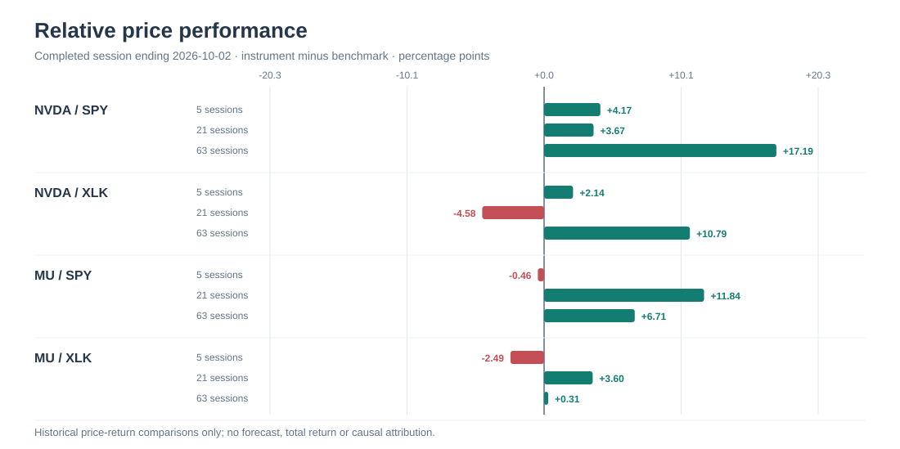
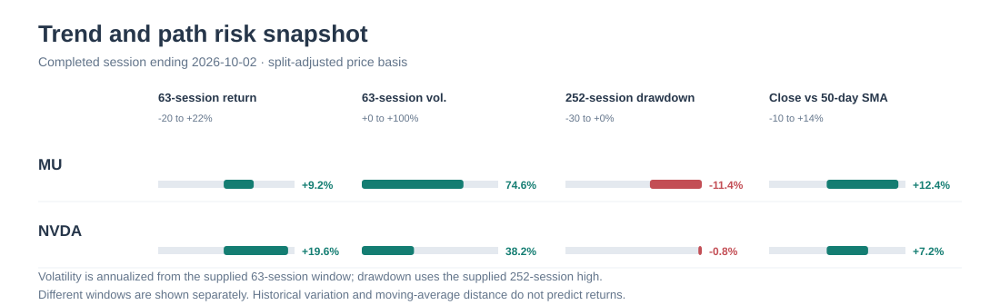
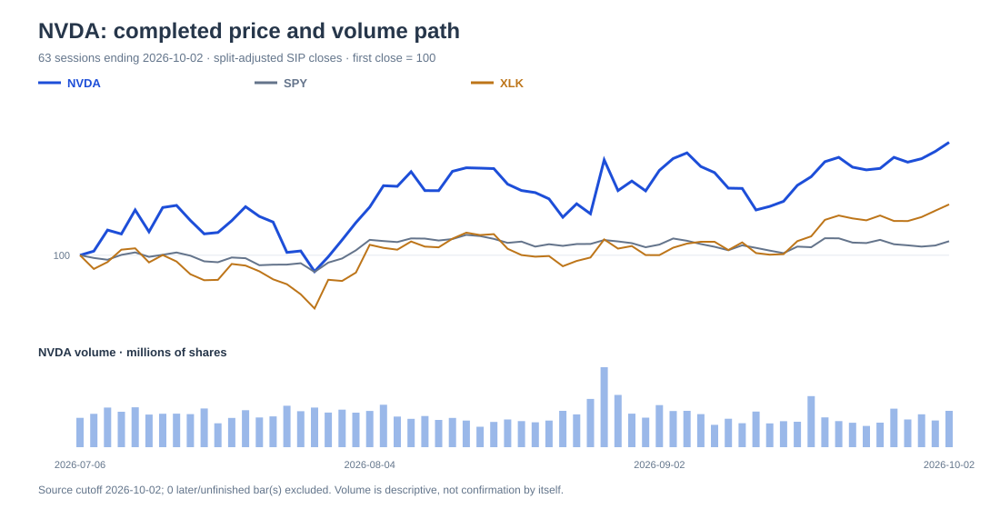
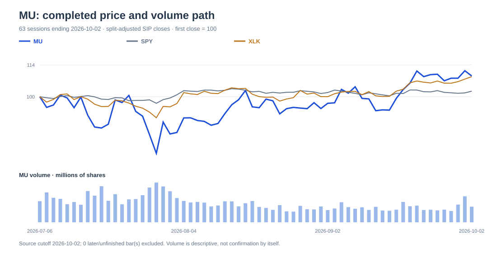

# Watchlist research

NOT PUBLISHED · no observation issued

Final research draft: both NVDA and MU remain conditional opportunities, not an unconditional pair ranking. NVDA has the cleaner 63-session price path; MU has a disclosed near-term guidance checkpoint but more cyclical execution sensitivity. Final revisions accept all Challenger objections: NVDA’s GAAP EPS bridge is expressly not treated as operating-only, no unsupported guidance-superiority comparison remains, and the capacity claim is narrowed/removed.

## NVDA — conditional_opportunity

Conditional interest rests on strong reported revenue, constructive 63-session behavior, and a total-GAAP-EPS sensitivity framework, provided demand, supply and policy developments support earnings without assuming that first-half GAAP EPS is purely operational.

Counter-case: China data-center access was effectively foreclosed in the filing, and a large first-half non-operating gain component means a demand-only earnings continuation cannot be inferred; multiple compression or demand/supply disappointment can invalidate the case.

Valuation: FY2027 is January 26, 2026-January 31, 2027 (53 weeks, including a 14-week Q4). Reported first-half US-GAAP diluted EPS was $4.85, but included $24.140bn other income and $23.707bn equity-security gains; it is therefore not a clean operating EPS anchor. Bear/base/bull total-GAAP-EPS assumptions of $8.85/$9.85/$10.85 leave $4/$5/$6 residual EPS under constant shares, respectively. At fixed 24x, break-even EPS is $9.7479; at fixed $9.85 EPS, break-even P/E is 23.7513x. Bear/base/bull price sensitivities are -31.91%/+1.05%/+39.13%; stipulated bull gain exceeds absolute bear loss by 7.22pp. These cases combine earnings and multiple risk and are neither probabilities nor fair values.

Business — supported
Reported revenue and GAAP profitability are strong historical facts.
Qualification: GAAP EPS cannot be read as solely operating performance because of disclosed equity-security gains; second-half operating durability is conditional.

Valuation — conditional
The stipulated base approximately reproduces the dated close as total-GAAP-EPS arithmetic.
Qualification: No observed multiple, consensus, or recurring operating-EPS bridge supports fair value.

Market Behavior — supported
NVDA has the cleaner 63-session path of the pair.
Qualification: It lagged XLK over 21 sessions; descriptive analogs do not forecast returns.

Policy Exposure — conditional
China data-center exclusion is a disclosed material constraint.
Qualification: Magnitude and future licensing outcome are unquantified.

Relative Preference — conditional
NVDA is technically preferable over the exact 63-session window only.
Qualification: This conditional preference depends on business durability, hypothetical valuation inputs, and no worsening policy/supply outcome; it is not an all-dimension ranking.

### Overall assessment

Conditional opportunity: market behavior is cleaner at 63 sessions, but policy constraints and an unreconciled recurring-operating EPS bridge limit conviction.

### Global forces

- AI demand and supply execution: Demand, mix and supplier continuity determine earnings after the reported period. Consequence: A miss can weaken EPS while a lower multiple compounds the result. (evidence: dcc8d17af598e8b9252b0fd30e626b9391716ae80eb16d058d68bf5dbffea6b1, 5eab50a9000d83ca11d033acbaedcd4342474df2f2e4e2bc518a38935d5204ad)
- China export policy: Two-government product approval and licensing constrain data-center addressability. Consequence: Continued exclusion limits optional demand; documented access changes the policy case. (evidence: 1b764e3bdd5420bff9d4a0fdcb057c6bf12f1a0bb95b5e8e7380cdf97f7d19ee, cc9b6af0d48f7515a97e3cf57213dcb0099917992a68d5a41025ef358fae9323)
- Rates and risk appetite: Discount-rate repricing can move technology valuations before customer spending changes. Consequence: Near-term price volatility can diverge from operations. (evidence: 8213c11a6c7ca199b78c5a6cccda352c299a3c9fce2de5d634cabdb8a7eed91f, 456d6cc9c748bcdc0eede1228e44a13c4a676df79411fdf8adb9ff6a4f009696, f770243fc487303c1f757d28fef52fe42d573c2722bba0617e6ece6adfff15da, ce19cc61543bc9f1a50f4b92a24814d7dab9d986ebd3886dec0a2cde5a96ba45)
- AI-cloud infrastructure commitments: Land, power and shell guarantees create an indirect partner-default exposure, not a direct commodity-beta estimate. Consequence: Infrastructure stress could impair the demand/execution bridge. (evidence: bf8888a6951054c0c0747055c0b22ab8155ce4c9184b9670bcdc822852d0d1be)

### Conditional outcomes

- bear: If Demand/mix or supply disappoints, policy remains restrictive, and P/E compresses. → Stipulated $159.30 sensitivity, -31.91% from the October 2 close. Plausibility: Explicit joint total-EPS/multiple stress, not a probability. (evidence: 5eab50a9000d83ca11d033acbaedcd4342474df2f2e4e2bc518a38935d5204ad)
- base: If Total GAAP EPS reaches the stipulated $9.85 and the 24x assumption holds, without inferring a pure operating continuation from first-half EPS. → Stipulated $236.40 sensitivity, +1.05%. Plausibility: Arithmetic assumption; recurring operating support remains unproven. (evidence: 5eab50a9000d83ca11d033acbaedcd4342474df2f2e4e2bc518a38935d5204ad, dbd0a9ac6294dcb2dc515039b1cc578e347beec38b55d2e5f930b71a2279bd1b)
- bull: If Demand/mix is stronger, supply remains available and a 30x multiple holds without added policy disruption. → Stipulated $325.50 sensitivity, +39.13%. Plausibility: Explicit stress assumption only. (evidence: 5eab50a9000d83ca11d033acbaedcd4342474df2f2e4e2bc518a38935d5204ad)

### What to consider

Across 5/21/63 sessions, consider confirmation of sector-relative leadership and an operating earnings bridge before treating the grid as informative. Reassess immediately on China-access, supply, or earnings-composition disclosures.

### Short summary

NVDA's 63-session behavior is cleaner, but the valuation sensitivity is conditional total-GAAP arithmetic rather than a validated operating forecast.

Assumptions:
- FY2027 EPS and 18x/24x/30x P/E inputs are analyst total-GAAP-EPS sensitivities.
- The October 2 close is a completed close; IEX is not a current consolidated quote.
- Residual EPS is constant-share arithmetic and does not isolate recurring operations.

Review conditions:
- Completed-close review: NVDA below 223.786 (split_adjusted); expires 2027-01-08T21:00:00Z; evidence dates: 2026-10-02 / retrieved 2026-10-04T17:21:36.507680+00:00. A completed split-adjusted close below the October 2 SMA20 of 223.786 would weaken the short-trend continuation case and trigger reassessment. — not an executable order.
- Human review: Review on results or authoritative policy disclosure: evidence that operating earnings excluding material equity-security gains weaken, or that China data-center access worsens, weakens the case; recurring operating support or viable access would improve it.

Claims:
- fact: NVIDIA reported $177.837bn revenue and $4.85 GAAP diluted EPS for the six months ended July 26, 2026; FY2027 is a 53-week year with a 14-week fourth quarter. However, the same six-month period included $24.140bn other income, including $23.707bn gains from equity securities, so reported GAAP EPS is not a stand-alone operating-demand measure. ([dcc8d17af598](evidence/dcc8d17af598e8b9252b0fd30e626b9391716ae80eb16d058d68bf5dbffea6b1.json), [dbd0a9ac6294](evidence/dbd0a9ac6294dcb2dc515039b1cc578e347beec38b55d2e5f930b71a2279bd1b.json), [31f8275e9c4e](evidence/31f8275e9c4e84f31a9bbb17be4dd44f3303b4f749b1249ebf124a7373c1c616.json))
- scenario: NVDA's FY2027 January 26, 2026-January 31, 2027 grid is a total-GAAP-EPS sensitivity, not an operating-EPS forecast: stipulated $8.85/$9.85/$10.85 EPS and 18x/24x/30x P/E inputs produce -31.91%/+1.05%/+39.13% from the October 2 completed close. The $4/$5/$6 residuals after reported first-half $4.85 EPS are constant-share arithmetic only and are not supported by a simple operating continuation because of the disclosed non-operating gains. ([dcc8d17af598](evidence/dcc8d17af598e8b9252b0fd30e626b9391716ae80eb16d058d68bf5dbffea6b1.json), [ea2d5c6b89f9](evidence/ea2d5c6b89f97332439d020e49ffb531ac6d8ad4be9603a4a48a313406a06c4e.json), [5eab50a9000d](evidence/5eab50a9000d83ca11d033acbaedcd4342474df2f2e4e2bc518a38935d5204ad.json), [dbd0a9ac6294](evidence/dbd0a9ac6294dcb2dc515039b1cc578e347beec38b55d2e5f930b71a2279bd1b.json))
- inference: Over the exact 63-session completed-close window ending October 2, NVDA's +19.6369% return, +10.7902pp excess versus XLK, 38.25% realized volatility, and -10.5835% maximum close-path drawdown compare with MU's +9.1536%, +0.3068pp, 74.56%, and -25.4770%. This supports a narrower technical preference for NVDA at 63 sessions, not a business or fair-value ranking; MU led NVDA on 21-session excess versus SPY and both historical-regime samples are descriptive rather than calibrated forecasts. ([553997eca627](evidence/553997eca6279323c1fa7b2d98c111bc4250465042d553d2a928ff4c776c0775.json), [ea2d5c6b89f9](evidence/ea2d5c6b89f97332439d020e49ffb531ac6d8ad4be9603a4a48a313406a06c4e.json), [782c40d41a0d](evidence/782c40d41a0d9e1eb2d8f0f13630a7a806557f9b106e9bafd70697d7fad6c83f.json), [8821b5f39194](evidence/8821b5f391944b13f15e5ffe2d6ab5a22754025fd1709b4cfe430e8dc95c3230.json), [bbd6dbe9d4a8](evidence/bbd6dbe9d4a800d78ff4fe19d1282ee3913cd1c3db5cc69528c2f716e0a53246.json), [5cb2cb2acb8e](evidence/5cb2cb2acb8e589a354824b6fd4264dcc15633df0c8d912e2cc2340ec3b517fa.json))
- inference: Policy risk is qualitatively different but not quantitatively rankable: NVDA disclosed effective foreclosure from China data-center compute despite a dated case-by-case rule for qualifying items, while MU disclosed possible tariff/trade-investigation effects whose scope and impact remain uncertain. Neither record supplies revenue, margin, or sourcing weights sufficient for a policy-loss comparison. ([f94f1f83f261](evidence/f94f1f83f261338c24375b61bd4f987f41afd2b479d3dcba16719c480de50d7d.json), [1b764e3bdd54](evidence/1b764e3bdd5420bff9d4a0fdcb057c6bf12f1a0bb95b5e8e7380cdf97f7d19ee.json), [cc9b6af0d48f](evidence/cc9b6af0d48f7515a97e3cf57213dcb0099917992a68d5a41025ef358fae9323.json))
- inference: Late-September rising 10-year yields, XLK strength, and weak IWM/HYG completed-session behavior identify competing discount-rate and risk-appetite channels for both stocks, rather than a proven macro regime or issuer-specific causality. ([8213c11a6c7c](evidence/8213c11a6c7ca199b78c5a6cccda352c299a3c9fce2de5d634cabdb8a7eed91f.json), [456d6cc9c748](evidence/456d6cc9c748bcdc0eede1228e44a13c4a676df79411fdf8adb9ff6a4f009696.json), [f770243fc487](evidence/f770243fc487303c1f757d28fef52fe42d573c2722bba0617e6ece6adfff15da.json), [ce19cc61543b](evidence/ce19cc61543bc9f1a50f4b92a24814d7dab9d986ebd3886dec0a2cde5a96ba45.json), [3d877291ef05](evidence/3d877291ef05c300478203e9e949ecf61579b13e7ed5b7c6e5561d0145f3c9da.json))

## MU — conditional_opportunity

Record FY2026 results and a specific FQ1 guidance checkpoint support conditional interest if AI-memory demand, pricing, mix and utilization remain elevated beyond FQ1.

Counter-case: The post-FQ1 earnings bridge is highly sensitive to memory-cycle normalization and multiple compression, while observed volatility and drawdown are materially higher than NVDA's.

Valuation: FY2027 grid is September 4, 2026-September 2, 2027, although the exact fiscal calendar remains unverified. FY2026 GAAP EPS was $74.33; the FQ1 FY2027 GAAP EPS outlook is $37.84 plus or minus $1.00. Bear/base/bull FY2027 EPS assumptions of $125/$150/$175 leave $87.16/$112.16/$137.16 after the FQ1 midpoint under constant shares. At fixed 7.2x, break-even EPS is $149.2903; at fixed $150 EPS, break-even P/E is 7.1659x. Bear/base/bull sensitivities are -30.23%/+0.48%/+38.39%; stipulated bull gain exceeds absolute bear loss by 8.16pp. Joint memory-cycle earnings and multiple risk is material; the cases are not guidance, probabilities, targets, or attractiveness evidence.

Business — supported
Reported FY2026 results and the disclosed FQ1 outlook establish exceptional current profitability and a near-term checkpoint.
Qualification: They do not establish post-FQ1 pricing, mix, utilization, or full-year durability.

Valuation — conditional
The stipulated base approximately reproduces the dated close.
Qualification: No observed P/E or consensus supports fair value, and the exact fiscal endpoint needs confirmation.

Market Behavior — supported
MU has positive 21/63-session excess returns but higher volatility and substantially deeper 63-session path drawdown than NVDA.
Qualification: Its five-session relative signs are negative and historical analogs are not forecasts.

Policy Exposure — conditional
Potential tariffs and trade restrictions are plausible cost and demand channels.
Qualification: No final covered measure or quantified issuer impact is established.

Relative Preference — conditional
MU has a disclosed near-term results checkpoint, while NVDA has cleaner 63-session technical behavior; no unconditional pair ranking follows.
Qualification: The comparative conclusion is limited to the cited technical and policy facts; post-FQ1 margin durability, valuation and policy impacts remain unquantified.

### Overall assessment

Conditional opportunity: current results and near-term guidance are unusually strong, but the decision depends on demonstrating post-FQ1 memory-cycle durability amid greater observed path risk.

### Global forces

- AI-memory demand, pricing and utilization: Product mix and memory pricing determine whether profitability persists beyond guided FQ1. Consequence: Normalization would weaken residual EPS and could combine with multiple compression. (evidence: 730ce5b64a145ecb0ceeaca3c1b88524d56f658ccd1b2d277dda8066007e4335, e7914867d23161282a27b5577bfd45f8b59050293eedc3087fc042741f40e4d7, 68c4f8393e208857753dc6fec70448f238168935805b5b97645bd7bde38fc435)
- Trade-policy uncertainty: Potential tariffs or restrictions can raise costs, delay mitigation, or affect customer demand. Consequence: A final covered action would weaken margin/demand assumptions. (evidence: f94f1f83f261338c24375b61bd4f987f41afd2b479d3dcba16719c480de50d7d)
- Rates and selective risk appetite: Discount-rate changes affect valuation conditions while technology, small-cap and credit proxies diverge. Consequence: Price can reprice before reported demand changes. (evidence: 8213c11a6c7ca199b78c5a6cccda352c299a3c9fce2de5d634cabdb8a7eed91f, 456d6cc9c748bcdc0eede1228e44a13c4a676df79411fdf8adb9ff6a4f009696, f770243fc487303c1f757d28fef52fe42d573c2722bba0617e6ece6adfff15da, ce19cc61543bc9f1a50f4b92a24814d7dab9d986ebd3886dec0a2cde5a96ba45)
- Supply-chain and input disruption: Memory manufacturing depends on inventories, equipment and facilities, but supplied evidence does not quantify commodity pass-through. Consequence: Disruption is a downside channel, not a direct oil/metals call. (evidence: 62e14eb8046cc6be0a4b99ca6527a31bb3551d328fbb8c790780cfd48821b13a)

### Conditional outcomes

- bear: If Memory pricing/mix normalizes after FQ1 and P/E compresses. → Stipulated $750 sensitivity, -30.23% from the October 2 close. Plausibility: Explicit joint EPS/multiple stress, not a probability. (evidence: 68c4f8393e208857753dc6fec70448f238168935805b5b97645bd7bde38fc435)
- base: If AI-memory demand and profitability broadly sustain the stipulated $150 FY2027 EPS. → Stipulated $1,080 sensitivity, +0.48%. Plausibility: FQ1 guidance supports a starting point only; the post-FQ1 bridge is assumed. (evidence: 730ce5b64a145ecb0ceeaca3c1b88524d56f658ccd1b2d277dda8066007e4335, 68c4f8393e208857753dc6fec70448f238168935805b5b97645bd7bde38fc435)
- bull: If Pricing, mix and utilization remain stronger than base and the higher multiple holds. → Stipulated $1,487.50 sensitivity, +38.39%. Plausibility: Explicit stress assumption only. (evidence: 68c4f8393e208857753dc6fec70448f238168935805b5b97645bd7bde38fc435)

### What to consider

Over 5/21/63 sessions, prioritize the post-FQ1 margin, pricing, utilization and outlook test, alongside a return to positive short-window sector-relative behavior. Do not use scenario prices as executable targets.

### Short summary

MU offers a concrete near-term guidance checkpoint but carries a more cyclical earnings bridge and greater observed price-path risk than NVDA.

Assumptions:
- FY2027 EPS and 6x/7.2x/8.5x P/E inputs are analyst sensitivities.
- Exact FY2027 fiscal-calendar endpoint remains to be verified.
- The October 2 close is completed-session data, not a current executable quote.

Review conditions:
- Completed-close review: MU below 1025.0015 (split_adjusted); expires 2027-01-08T21:00:00Z; evidence dates: 2026-10-02 / retrieved 2026-10-04T17:21:35.565774+00:00. A completed split-adjusted close below the October 2 SMA20 of 1025.0015 would weaken the rebound case and trigger reassessment. — not an executable order.
- Human review: Review post-FQ1 revenue, GAAP margin, EPS and outlook against the disclosed guidance. A material miss or lower outlook weakens the post-FQ1 residual-EPS assumption; delivery with sustained outlook supports it.

Claims:
- fact: Micron reported FY2026 revenue of $133.188bn and GAAP diluted EPS of $74.33. Its disclosed FQ1 FY2027 outlook is $61.5bn plus or minus $1.5bn revenue, approximately 85.95% GAAP gross margin, and $37.84 plus or minus $1.00 GAAP diluted EPS. This provides a near-term MU checkpoint, not a comparison with an unassessed NVIDIA outlook. ([730ce5b64a14](evidence/730ce5b64a145ecb0ceeaca3c1b88524d56f658ccd1b2d277dda8066007e4335.json), [e7914867d231](evidence/e7914867d23161282a27b5577bfd45f8b59050293eedc3087fc042741f40e4d7.json))
- scenario: MU's FY2027 grid, September 4, 2026-September 2, 2027 with exact calendar still to verify, stipulates $125/$150/$175 EPS and 6x/7.2x/8.5x P/E inputs. It produces -30.23%/+0.48%/+38.39% from the October 2 completed close; the $87.16/$112.16/$137.16 residuals after the FQ1 guided EPS midpoint are constant-share arithmetic, not management full-year guidance. ([553997eca627](evidence/553997eca6279323c1fa7b2d98c111bc4250465042d553d2a928ff4c776c0775.json), [730ce5b64a14](evidence/730ce5b64a145ecb0ceeaca3c1b88524d56f658ccd1b2d277dda8066007e4335.json), [e7914867d231](evidence/e7914867d23161282a27b5577bfd45f8b59050293eedc3087fc042741f40e4d7.json), [aba8cdc64059](evidence/aba8cdc64059d9206f6db69970921fd283c96b8dae7f0b80baa28af62825348e.json), [68c4f8393e20](evidence/68c4f8393e208857753dc6fec70448f238168935805b5b97645bd7bde38fc435.json))
- inference: Over the exact 63-session completed-close window ending October 2, NVDA's +19.6369% return, +10.7902pp excess versus XLK, 38.25% realized volatility, and -10.5835% maximum close-path drawdown compare with MU's +9.1536%, +0.3068pp, 74.56%, and -25.4770%. This supports a narrower technical preference for NVDA at 63 sessions, not a business or fair-value ranking; MU led NVDA on 21-session excess versus SPY and both historical-regime samples are descriptive rather than calibrated forecasts. ([553997eca627](evidence/553997eca6279323c1fa7b2d98c111bc4250465042d553d2a928ff4c776c0775.json), [ea2d5c6b89f9](evidence/ea2d5c6b89f97332439d020e49ffb531ac6d8ad4be9603a4a48a313406a06c4e.json), [782c40d41a0d](evidence/782c40d41a0d9e1eb2d8f0f13630a7a806557f9b106e9bafd70697d7fad6c83f.json), [8821b5f39194](evidence/8821b5f391944b13f15e5ffe2d6ab5a22754025fd1709b4cfe430e8dc95c3230.json), [bbd6dbe9d4a8](evidence/bbd6dbe9d4a800d78ff4fe19d1282ee3913cd1c3db5cc69528c2f716e0a53246.json), [5cb2cb2acb8e](evidence/5cb2cb2acb8e589a354824b6fd4264dcc15633df0c8d912e2cc2340ec3b517fa.json))
- inference: Policy risk is qualitatively different but not quantitatively rankable: NVDA disclosed effective foreclosure from China data-center compute despite a dated case-by-case rule for qualifying items, while MU disclosed possible tariff/trade-investigation effects whose scope and impact remain uncertain. Neither record supplies revenue, margin, or sourcing weights sufficient for a policy-loss comparison. ([f94f1f83f261](evidence/f94f1f83f261338c24375b61bd4f987f41afd2b479d3dcba16719c480de50d7d.json), [1b764e3bdd54](evidence/1b764e3bdd5420bff9d4a0fdcb057c6bf12f1a0bb95b5e8e7380cdf97f7d19ee.json), [cc9b6af0d48f](evidence/cc9b6af0d48f7515a97e3cf57213dcb0099917992a68d5a41025ef358fae9323.json))
- inference: Late-September rising 10-year yields, XLK strength, and weak IWM/HYG completed-session behavior identify competing discount-rate and risk-appetite channels for both stocks, rather than a proven macro regime or issuer-specific causality. ([8213c11a6c7c](evidence/8213c11a6c7ca199b78c5a6cccda352c299a3c9fce2de5d634cabdb8a7eed91f.json), [456d6cc9c748](evidence/456d6cc9c748bcdc0eede1228e44a13c4a676df79411fdf8adb9ff6a4f009696.json), [f770243fc487](evidence/f770243fc487303c1f757d28fef52fe42d573c2722bba0617e6ece6adfff15da.json), [ce19cc61543b](evidence/ce19cc61543bc9f1a50f4b92a24814d7dab9d986ebd3886dec0a2cde5a96ba45.json), [3d877291ef05](evidence/3d877291ef05c300478203e9e949ecf61579b13e7ed5b7c6e5561d0145f3c9da.json))

## Shared exposures

- Both face AI/semiconductor demand, supply-chain execution, trade-policy and discount-rate channels, but available records do not quantify common customer, supplier, revenue, margin, commodity or correlation weights. — Qualitative shared channels only; not a portfolio, correlation, or direct commodity-exposure estimate.

## Role coverage

- company: completed — Reported results, guidance, fiscal calendars, earnings composition and deterministic scenario grids were assessed.
- macro: completed — Rates and risk-proxy transmission channels were assessed as conditional rather than causal.
- technical: completed — Completed-close trends, relative strength, volatility, drawdown and analog limitations were assessed.
- geopolitics: completed — Dated export/trade rules and issuer disclosures were assessed, with impact magnitude left unquantified.
- commodities: completed — Supply/input and infrastructure-disruption channels were assessed; direct commodity beta was not evidenced.

## Evidence gaps

- NVDA,MU: No observed forward P/E, consensus, empirical multiple history, or recurring NVDA operating-EPS bridge supports a fair-value conclusion. The stated grids remain hypothetical total-EPS sensitivities only.
- NVDA,MU: Policy documents and filings do not quantify issuer revenue, margin, customer, sourcing, or pass-through exposure. This blocks a policy-impact ranking but not the documented qualitative distinction.
- NVDA,MU: Direct commodity-price beta or quantified input-cost sensitivity was not established in the reviewed records. Oil, gold, dollar and international-equity ETFs are market proxies, not causal evidence.

## Question effects

## Challenge dispositions

- task-9-o1 / changed: Accepted. NVDA business and valuation text now states the $24.140bn other-income and $23.707bn equity-security-gain component, removes the operating-continuation implication, and treats residuals as total-GAAP-EPS scenario arithmetic only.
- task-9-o2 / changed: Accepted. MU is described only as having a disclosed near-term FQ1 guidance checkpoint; final text makes no ordinal claim that its outlook is stronger than NVIDIA's.
- task-9-o3 / changed: Accepted. The unsupported shared capacity characterization was removed. Final commodity discussion is limited to an unquantified disruption channel and explicitly declines a direct commodity comparison.

## Limitations

- Unpublished research; publication refresh, conditions evaluation and outcome scoring belong to M3.
- Market context uses only the frozen benchmark list; watchlist diagnostics are not market breadth.
- Source dates and missingness remain explicit. Scenario valuations are assumptions, not price targets or calibrated forecasts.
- Catalog cost is estimated; provider output-token and cost ceilings may be enforced after a response.

### Deterministic technical charts

Comparison panel: [recorded evidence](evidence/782c40d41a0d9e1eb2d8f0f13630a7a806557f9b106e9bafd70697d7fad6c83f.json). Positive is instrument outperformance; negative is underperformance.

Price evidence: [MU](evidence/553997eca6279323c1fa7b2d98c111bc4250465042d553d2a928ff4c776c0775.json), [NVDA](evidence/ea2d5c6b89f97332439d020e49ffb531ac6d8ad4be9603a4a48a313406a06c4e.json).

Historical overlapping forward-return frequencies conditional on three coarse price-regime signs. Samples are dependent, selected from one finite lookback, and are not calibrated probabilities, causal estimates, or guarantees. Report sample size and unconditional base rate alongside them.

The indexed paths use archived OHLCV only through the normalized completed close; later/unfinished bars are excluded. The summary comparison and risk charts use the same admitted cutoff. These are historical observations, not forecasts or executable quotes.

## Validated numerical evidence

Values below come directly from stored evidence. Open each source for full lineage and fields.

### [sec-submissions-MU](evidence/5351e24c9613537e315cc771af1d64fc0312d4e8eaf10ad01d5fa5313e8fdc99.json)

Full normalized fields are available through the evidence link.

### [sec-submissions-NVDA](evidence/c44a7f6fe2a103cc7ee006a1fdd4370583fd60a658f3ff7ed5313734644df2f5.json)

Full normalized fields are available through the evidence link.

### [sec-facts-MU](evidence/a81b818b9437715555f1632f127e1cd3d13152bbd61cd65b86ded5b9cffd3104.json)

| Metric | Value | Unit | Period start | Period end | Filed |
|---|---:|---|---|---|---|
| revenue (RevenueFromContractWithCustomerExcludingAssessedTax) | 78959000000 | USD | 2025-08-29 | 2026-05-28 | 2026-06-25 |
| net_income (NetIncomeLoss) | 47268000000 | USD | 2025-08-29 | 2026-05-28 | 2026-06-25 |
| operating_income (OperatingIncomeLoss) | 55589000000 | USD | 2025-08-29 | 2026-05-28 | 2026-06-25 |
| operating_cash_flow (NetCashProvidedByUsedInOperatingActivities) | 45702000000 | USD | 2025-08-29 | 2026-05-28 | 2026-06-25 |
| capital_expenditure (PaymentsToAcquirePropertyPlantAndEquipment) | 19602000000 | USD | 2025-08-29 | 2026-05-28 | 2026-06-25 |
| assets (Assets) | 134112000000 | USD | instant | 2026-05-28 | 2026-06-25 |
| liabilities (Liabilities) | 33388000000 | USD | instant | 2026-05-28 | 2026-06-25 |
| equity (StockholdersEquity) | 100724000000 | USD | instant | 2026-05-28 | 2026-06-25 |
| cash (CashAndCashEquivalentsAtCarryingValue) | 24995000000 | USD | instant | 2026-05-28 | 2026-06-25 |
| diluted_eps (EarningsPerShareDiluted) | 41.4 | USD/shares | 2025-08-29 | 2026-05-28 | 2026-06-25 |
| shares_outstanding (CommonStockSharesOutstanding) | 1129000000 | shares | instant | 2026-05-28 | 2026-06-25 |
| annual diluted EPS anchor | 7.59 | USD/shares | 2024-08-30 | 2025-08-28 | 2025-10-03 |
| annual diluted EPS anchor | 0.7 | USD/shares | 2023-09-01 | 2024-08-29 | 2025-10-03 |
| annual diluted EPS anchor | -5.34 | USD/shares | 2022-09-02 | 2023-08-31 | 2025-10-03 |

Fiscal durations are not silently annualized; debt concepts may cover only current maturities.

### [sec-facts-NVDA](evidence/dcc8d17af598e8b9252b0fd30e626b9391716ae80eb16d058d68bf5dbffea6b1.json)

| Metric | Value | Unit | Period start | Period end | Filed |
|---|---:|---|---|---|---|
| revenue (Revenues) | 177837000000 | USD | 2026-01-26 | 2026-07-26 | 2026-08-26 |
| net_income (NetIncomeLoss) | 118010000000 | USD | 2026-01-26 | 2026-07-26 | 2026-08-26 |
| operating_income (OperatingIncomeLoss) | 117270000000 | USD | 2026-01-26 | 2026-07-26 | 2026-08-26 |
| operating_cash_flow (NetCashProvidedByUsedInOperatingActivities) | 74421000000 | USD | 2026-01-26 | 2026-07-26 | 2026-08-26 |
| assets (Assets) | 320272000000 | USD | instant | 2026-07-26 | 2026-08-26 |
| liabilities (Liabilities) | 91288000000 | USD | instant | 2026-07-26 | 2026-08-26 |
| equity (StockholdersEquity) | 228984000000 | USD | instant | 2026-07-26 | 2026-08-26 |
| cash (CashAndCashEquivalentsAtCarryingValue) | 22443000000 | USD | instant | 2026-07-26 | 2026-08-26 |
| long_term_debt (LongTermDebtCurrent) | 1000000000 | USD | instant | 2026-07-26 | 2026-08-26 |
| diluted_eps (EarningsPerShareDiluted) | 4.85 | USD/shares | 2026-01-26 | 2026-07-26 | 2026-08-26 |
| shares_outstanding (CommonStockSharesOutstanding) | 24304000000 | shares | instant | 2026-01-25 | 2026-02-25 |
| annual diluted EPS anchor | 4.9 | USD/shares | 2025-01-27 | 2026-01-25 | 2026-02-25 |
| annual diluted EPS anchor | 2.94 | USD/shares | 2024-01-29 | 2025-01-26 | 2026-02-25 |
| annual diluted EPS anchor | 1.19 | USD/shares | 2023-01-30 | 2024-01-28 | 2026-02-25 |

Fiscal durations are not silently annualized; debt concepts may cover only current maturities.

### [price-MU](evidence/553997eca6279323c1fa7b2d98c111bc4250465042d553d2a928ff4c776c0775.json)

MU · 2026-10-02 · FRESH · sip · split_adjusted · price return

| Metric | Recorded value |
|---|---:|
| latest_close | 1074.89 |
| sma20 | 1025.0014999999999 |
| sma50 | 956.0457000000001 |
| sma200 | 681.614275 |
| rsi14_simple | 74.88453417788335 |
| return5_pct | -0.6828177551095771 |
| return21_pct | 12.426784369508837 |
| return63_pct | 9.153592282305167 |
| realized_vol63_pct | 74.562367571875 |

### [price-NVDA](evidence/ea2d5c6b89f97332439d020e49ffb531ac6d8ad4be9603a4a48a313406a06c4e.json)

NVDA · 2026-10-02 · FRESH · sip · split_adjusted · price return

| Metric | Recorded value |
|---|---:|
| latest_close | 233.95 |
| sma20 | 223.78599999999997 |
| sma50 | 218.2782 |
| sma200 | 200.7146 |
| rsi14_simple | 82.96529968454259 |
| return5_pct | 3.945439196694367 |
| return21_pct | 4.251147453322046 |
| return63_pct | 19.6369215034518 |
| realized_vol63_pct | 38.247306474537 |

### [price-SPY](evidence/324a5b33fdc0f32c64edbaf919c26863a4f3ee298fb917bc9185025c81ec3e38.json)

SPY · 2026-10-02 · FRESH · sip · split_adjusted · price return

| Metric | Recorded value |
|---|---:|
| latest_close | 769.64 |
| sma20 | 764.8285 |
| sma50 | 763.7021999999998 |
| sma200 | 720.471 |
| rsi14_simple | 58.063328424153134 |
| return5_pct | -0.22168924612692154 |
| return21_pct | 0.5854984578388844 |
| return63_pct | 2.443829198168457 |
| realized_vol63_pct | 11.003568230609359 |

### [price-XLK](evidence/8213c11a6c7ca199b78c5a6cccda352c299a3c9fce2de5d634cabdb8a7eed91f.json)

XLK · 2026-10-02 · FRESH · sip · split_adjusted · price return

| Metric | Recorded value |
|---|---:|
| latest_close | 199.81 |
| sma20 | 191.26799999999997 |
| sma50 | 186.30219999999997 |
| sma200 | 164.94025000000002 |
| rsi14_simple | 83.36914482165878 |
| return5_pct | 1.8036378458246238 |
| return21_pct | 8.828976034858393 |
| return63_pct | 8.846761453396535 |
| realized_vol63_pct | 25.813718764085717 |

### [price-IWM](evidence/456d6cc9c748bcdc0eede1228e44a13c4a676df79411fdf8adb9ff6a4f009696.json)

IWM · 2026-10-02 · FRESH · sip · split_adjusted · price return

| Metric | Recorded value |
|---|---:|
| latest_close | 281.52 |
| sma20 | 285.01050000000004 |
| sma50 | 292.57660000000004 |
| sma200 | 276.32 |
| rsi14_simple | 36.41003828158218 |
| return5_pct | -0.15959144589852148 |
| return21_pct | -4.2481548246658285 |
| return63_pct | -5.814653730344599 |
| realized_vol63_pct | 13.302869011351902 |

### [price-HYG](evidence/f770243fc487303c1f757d28fef52fe42d573c2722bba0617e6ece6adfff15da.json)

HYG · 2026-10-02 · FRESH · sip · split_adjusted · price return

| Metric | Recorded value |
|---|---:|
| latest_close | 76.91 |
| sma20 | 78.20900000000002 |
| sma50 | 79.00439999999999 |
| sma200 | 79.88575 |
| rsi14_simple | 19.083969465648835 |
| return5_pct | -1.2201387105060357 |
| return21_pct | -2.7809379345215546 |
| return63_pct | -3.706022286215105 |
| realized_vol63_pct | 3.618912741128176 |

### [fred-DGS10](evidence/ce19cc61543bc9f1a50f4b92a24814d7dab9d986ebd3886dec0a2cde5a96ba45.json)

Full normalized fields are available through the evidence link.

### [fred-DFF](evidence/3d877291ef05c300478203e9e949ecf61579b13e7ed5b7c6e5561d0145f3c9da.json)

Full normalized fields are available through the evidence link.

### [price-EEM](evidence/e7e4a1b1fce48fc8ea0c61dd12e24d8dde03f5d627e2f6f6851302b2dcba9c89.json)

EEM · 2026-10-02 · FRESH · sip · split_adjusted · price return

| Metric | Recorded value |
|---|---:|
| latest_close | 67.67 |
| sma20 | 67.45 |
| sma50 | 66.4062 |
| sma200 | 62.99459999999999 |
| rsi14_simple | 59.65517241379315 |
| return5_pct | -0.4560164754339513 |
| return21_pct | 0.7743857036485391 |
| return63_pct | 0.14799467219182016 |
| realized_vol63_pct | 23.810079464291785 |

### [price-EFA](evidence/057b8b20a2464cc07bca339be50f2be0e40b33b26ed0cda7cf925bfd96a8ecf0.json)

EFA · 2026-10-02 · FRESH · sip · split_adjusted · price return

| Metric | Recorded value |
|---|---:|
| latest_close | 103.96 |
| sma20 | 105.50250000000001 |
| sma50 | 106.48179999999998 |
| sma200 | 102.5934 |
| rsi14_simple | 41.70324846356455 |
| return5_pct | -1.5157256536566965 |
| return21_pct | -2.895572576125549 |
| return63_pct | -1.4223402237815264 |
| realized_vol63_pct | 12.973522482614543 |

### [price-GLD](evidence/70402cd1cd262248db84342fda43b0ff79f5969ddac9468b971a80998cb03402.json)

GLD · 2026-10-02 · FRESH · sip · split_adjusted · price return

| Metric | Recorded value |
|---|---:|
| latest_close | 380.14 |
| sma20 | 393.21000000000004 |
| sma50 | 396.2926 |
| sma200 | 416.1553 |
| rsi14_simple | 38.412408759124105 |
| return5_pct | -3.3730713504994903 |
| return21_pct | -5.620934505188934 |
| return63_pct | -0.5207651846230399 |
| realized_vol63_pct | 24.520184041141334 |

### [price-USO](evidence/0442f2d6709cdddb6d9b53eb80e7095a3f557ecccc3d25605e2d3475b825dc75.json)

USO · 2026-10-02 · FRESH · sip · split_adjusted · price return

| Metric | Recorded value |
|---|---:|
| latest_close | 147.37 |
| sma20 | 150.69799999999998 |
| sma50 | 137.367 |
| sma200 | 115.17275000000001 |
| rsi14_simple | 41.462966366476756 |
| return5_pct | -0.6472055551810185 |
| return21_pct | 4.406659582004968 |
| return63_pct | 41.22664111164352 |
| realized_vol63_pct | 52.26962981867283 |

### [price-UUP](evidence/e54a50e88417b2534a5dc1c84a5be0e4e12a1461b775192d8b9020294299f34b.json)

UUP · 2026-10-02 · FRESH · sip · split_adjusted · price return

| Metric | Recorded value |
|---|---:|
| latest_close | 28.89 |
| sma20 | 28.434999999999995 |
| sma50 | 28.264 |
| sma200 | 27.755 |
| rsi14_simple | 84.61538461538458 |
| return5_pct | 0.943396226415083 |
| return21_pct | 2.555910543130979 |
| return63_pct | 2.012711864406791 |
| realized_vol63_pct | 5.19374796161255 |

### [snapshot-NVDA](evidence/6c86429766dc5178afb7c8750df2a9123159ab0a82e24cffed36b2d43635d616.json)

Full normalized fields are available through the evidence link.

### [snapshot-MU](evidence/6aea5e23cc83a9582097531dbc6f2bd8035529c85adf141431b535bf449258ed.json)

Full normalized fields are available through the evidence link.

### [782c40d41a0d](evidence/782c40d41a0d9e1eb2d8f0f13630a7a806557f9b106e9bafd70697d7fad6c83f.json)

| Symbol | Benchmark | Date | Status | Excess 5 / 21 / 63 sessions (pp) |
|---|---|---|---|---:|
| NVDA | SPY | 2026-10-02 | FRESH | 4.16712844282128854 / 3.6656489954831616 / 17.193092305283343 |
| NVDA | XLK | 2026-10-02 | FRESH | 2.1418013508697432 / -4.577828581536347 / 10.790160050055265 |
| MU | SPY | 2026-10-02 | FRESH | -0.46112850898265556 / 11.8412859116699526 / 6.709763084136710 |
| MU | XLK | 2026-10-02 | FRESH | -2.4864556009342009 / 3.597808334650444 / 0.306830828908632 |

Comparison gaps: `[]`

### [8821b5f39194](evidence/8821b5f391944b13f15e5ffe2d6ab5a22754025fd1709b4cfe430e8dc95c3230.json)

Full normalized fields are available through the evidence link.

### MU historical forward-return frequencies

As of 2026-10-02 · analog window 2023-12-18 to 2026-07-06

Current regime: `{"close_above_sma20": true, "return21_positive": true, "sma20_above_sma50": true}`

| Horizon | Conditional n | Positive frequency | Median | 10th / 90th pct | Unconditional positive frequency |
|---:|---:|---:|---:|---:|---:|
| 5 | 306 | 59.1503% | 2.3528% | -8.3105% / 16.4845% | 57.9278% (n=637) |
| 21 | 306 | 67.6471% | 5.9775% | -11.2838% / 39.6348% | 63.4223% (n=637) |
| 63 | 306 | 79.0850% | 31.8158% | -15.9730% / 81.1562% | 71.1146% (n=637) |

Historical overlapping forward-return frequencies conditional on three coarse price-regime signs. Samples are dependent, selected from one finite lookback, and are not calibrated probabilities, causal estimates, or guarantees. Report sample size and unconditional base rate alongside them.

### NVDA historical forward-return frequencies

As of 2026-10-02 · analog window 2023-12-18 to 2026-07-06

Current regime: `{"close_above_sma20": true, "return21_positive": true, "sma20_above_sma50": true}`

| Horizon | Conditional n | Positive frequency | Median | 10th / 90th pct | Unconditional positive frequency |
|---:|---:|---:|---:|---:|---:|
| 5 | 265 | 58.1132% | 1.1444% | -5.5420% / 8.8401% | 58.8697% (n=637) |
| 21 | 265 | 58.4906% | 3.6880% | -9.8039% / 25.9386% | 61.6954% (n=637) |
| 63 | 265 | 71.6981% | 10.9767% | -8.4506% / 40.1616% | 73.4694% (n=637) |

Historical overlapping forward-return frequencies conditional on three coarse price-regime signs. Samples are dependent, selected from one finite lookback, and are not calibrated probabilities, causal estimates, or guarantees. Report sample size and unconditional base rate alongside them.

### NVDA conditional valuation sensitivity

Assumed earnings period: 2026-01-26 to 2027-01-31 · US_GAAP · split_adjusted

Reference close: 233.95 on 2026-10-02

| Case | Assumed EPS | Assumed P/E | Scenario price | Change from dated close (%) |
|---|---:|---:|---:|---:|
| bear | 8.85 | 18 | 159.30 | -31.90852746313314810857020730925411412695 |
| base | 9.85 | 24 | 236.40 | 1.047232314597136140200897627698226116700 |
| bull | 10.85 | 30 | 325.50 | 39.13229322504808719811925625133575550330 |

FY2027 is a 53-week fiscal year ending January 31, 2027 (e41). Reported US-GAAP diluted EPS for the first six months is $4.85 (e4). Bear/base/bull full-year EPS assumptions of $8.85/$9.85/$10.85 therefore embed residual second-half EPS of $4.00/$5.00/$6.00, respectively, using a constant-share approximation; they are not management guidance or consensus. Bear tests AI-compute demand/mix or supply constraints reducing second-half profitability; base holds broadly similar per-quarter earnings despite the 14-week Q4; bull assumes demand and mix sustain stronger earnings. P/E inputs 18x/24x/30x are explicit stress assumptions, not observed, normal, fair, or probability-weighted multiples.

All EPS and P/E inputs are analyst assumptions, not observed multiples or consensus. Prices are conditional sensitivities, not forecasts, probabilities or executable quotes. The earnings period differs from the research horizon; assumption and share-basis suitability require review.

- bear: Hypothetical demand/mix or supply constraint stress plus multiple compression.
- base: Hypothetical sustained earnings through the unreported second half, with a 14-week Q4, at an assumed multiple.
- bull: Hypothetical stronger second-half demand/mix and continued premium multiple.
### MU conditional valuation sensitivity

Assumed earnings period: 2026-09-04 to 2027-09-02 · US_GAAP · split_adjusted

Reference close: 1074.89 on 2026-10-02

| Case | Assumed EPS | Assumed P/E | Scenario price | Change from dated close (%) |
|---|---:|---:|---:|---:|
| bear | 125 | 6 | 750 | -30.22541841490757193759361423029333234098 |
| base | 150 | 7.2 | 1080.0 | 0.475397482533096409865195508377601429000 |
| bull | 175 | 8.5 | 1487.5 | 38.38625347709998232377266510991822419040 |

FY2027 period dates are a calendar application of Micron's disclosed fiscal-year convention (Thursday closest to August 31); exact FY2027 calendar remains to be verified. FY2026 GAAP diluted EPS was $74.33 and FQ1 FY2027 GAAP diluted-EPS outlook is $37.84 ± $1.00 (e60, e59). Bear/base/bull FY2027 EPS assumptions of $125/$150/$175 are analyst stresses, not guidance or consensus. They embed $87.16/$112.16/$137.16 respectively after the FQ1 guidance midpoint under a constant diluted-share approximation: bear assumes memory pricing/mix or supply additions normalize margins after FQ1; base assumes AI-led data-center and cloud-memory demand broadly sustain elevated profitability; bull assumes stronger pricing/mix and execution. P/E inputs of 6x/7.2x/8.5x are explicit stress assumptions, not observed, normal, fair, or probability-weighted multiples.

All EPS and P/E inputs are analyst assumptions, not observed multiples or consensus. Prices are conditional sensitivities, not forecasts, probabilities or executable quotes. The earnings period differs from the research horizon; assumption and share-basis suitability require review.

- bear: Hypothetical margin/cycle normalization after guided FQ1 plus multiple compression.
- base: Hypothetical continuation of AI memory demand and elevated margins beyond guided FQ1 at an assumed multiple.
- bull: Hypothetical stronger pricing/mix and sustained high utilization beyond guided FQ1 at an assumed multiple.
### [snapshot-NVDA](evidence/8df79ce95ef7268aed5642a97e02dbcd6c6de22a1e8d73ea9c02d43e93443075.json)

Full normalized fields are available through the evidence link.

### [snapshot-MU](evidence/3262abe995cfb46da632c7cdf985192e7c74054d5e139358b046dc334ac97862.json)

Full normalized fields are available through the evidence link.

### [sec-submissions-MU](evidence/55dae78b1ea35ca87122c4d13c8bace602a9518513b35419ced501b3974a1529.json)

Full normalized fields are available through the evidence link.

### [sec-submissions-NVDA](evidence/4176534317b479ff10ada574450af5f00acf448f99d54817af365af8ef0e52e0.json)

Full normalized fields are available through the evidence link.

### [snapshot-NVDA](evidence/5b03613ea017e17f5c1c553f61c4b7d33136cd22c28f7d1b57e8b6164c82a791.json)

Full normalized fields are available through the evidence link.

### [snapshot-MU](evidence/9d87f04064c540c8ab4ea669e42076f1bb835af5e68d3155a2883c127bfc62c3.json)

Full normalized fields are available through the evidence link.

## Agent reports

### Overall assessment — completed

Recorded work: submit_findings: 3

Final research draft: both NVDA and MU remain conditional opportunities, not an unconditional pair ranking. NVDA has the cleaner 63-session price path; MU has a disclosed near-term guidance checkpoint but more cyclical execution sensitivity. Final revisions accept all Challenger objections: NVDA’s GAAP EPS bridge is expressly not treated as operating-only, no unsupported guidance-superiority comparison remains, and the capacity claim is narrowed/removed.

Short summary: NVDA is conditionally preferable only on the 63-session technical record; MU has a more directly testable near-term earnings checkpoint. Neither has sufficient evidence for a fair-value or all-dimension ranking.

### Company & valuation — completed

Recorded work: read_source: 2, inspect_evidence: 1, calculate_scenarios: 2, submit_findings: 1

Company research: both issuers show strong reported AI-linked earnings momentum, but valuation is conditional because no forward consensus or observed P/E is available. Deterministic FY sensitivities use the Oct. 2, 2026 split-adjusted closes and explicitly hypothetical EPS/P/E inputs.

Short summary: Reported operating momentum is strong for both companies, but the valuation work is deliberately conditional. The main distinction is NVDA's compute-demand/supply bridge versus MU's memory-price and margin-normalization bridge.

### Economy & markets — completed

Recorded work: read_source: 2, inspect_evidence: 2, submit_findings: 1

Macro evidence is mixed: long yields rose late September while the policy-rate series was unchanged; technology leadership coexisted with weak small-cap and high-yield ETF price performance and a firmer dollar proxy. This supports conditional—not directional—macro interpretation for NVDA and MU.

Short summary: Current macro proxies are mixed, favoring conditional monitoring over a directional macro call on NVDA or MU. The key discriminator is whether yield moves accompany resilient customer orders or inflation/funding stress.

### Price & market behavior — completed

Recorded work: inspect_evidence: 2, submit_findings: 1

Completed-session technical evidence is constructive for both stocks through 2026-10-02, but NVDA has the cleaner 63-session setup: stronger absolute return, materially positive excess versus both SPY and XLK, lower realized volatility and a shallower 63-session close-path drawdown. MU has a strong 21-session rebound and remains ahead over 63 sessions, but its five-session relative signs are negative, its 63-session XLK edge is only +0.3068 percentage points, and observed path risk is much higher. Historical regime frequencies are descriptive analogs, not calibrated probabilities.

Short summary: Technically, NVDA is preferred for the exact 63-session window, while MU is a higher-volatility rebound whose sector-relative edge is fragile. Both views require confirmation from future completed sessions rather than stale single-venue snapshots.

### Geopolitics & policy — completed

Recorded work: read_source: 1, inspect_evidence: 2, submit_findings: 1

Policy exposure is more direct for NVDA: its August 2026 filing says it was effectively foreclosed from China data-center compute despite the January case-by-case licensing rule. MU discloses prospective tariff/trade-investigation risk, but the supplied filing does not quantify exposure or establish a new tariff outcome.

Short summary: NVDA has the clearer, currently disclosed policy constraint: China data-center compute access remains effectively foreclosed in its filing. MU’s trade exposure is presently a conditional investigation/tariff risk rather than a measured impact.

### Inputs & commodities — completed

Recorded work: inspect_evidence: 3, submit_findings: 1

Independent commodities finding: NVDA has a supported, indirect infrastructure-capacity channel through supplier capacity and customer data-center land/power availability; neither issuer has a sourced direct oil/metals-price sensitivity. MU’s product-memory pricing cycle is distinct from commodity inputs, and current records do not size raw-material or energy pass-through.

Short summary: Commodity inputs do not presently provide a directional stock signal. NVDA’s customer-infrastructure and component-capacity dependence is the more actionable conditional channel; MU needs exposure data before costs can be sized.

### Independent challenge — completed

Recorded work: inspect_evidence: 4, submit_findings: 2

Review finds two material drafting issues: NVDA’s reported first-half GAAP EPS includes unusually large equity-security gains that are not reconciled to the operating EPS bridge, and the draft overstates a comparative advantage for MU’s guidance without comparable NVDA forward guidance. A minor capacity-channel claim misattributes its evidence.

Short summary: The draft preserves useful conditional scenario arithmetic, but needs clearer separation of NVDA operating performance from non-operating gains and tighter comparative wording.

