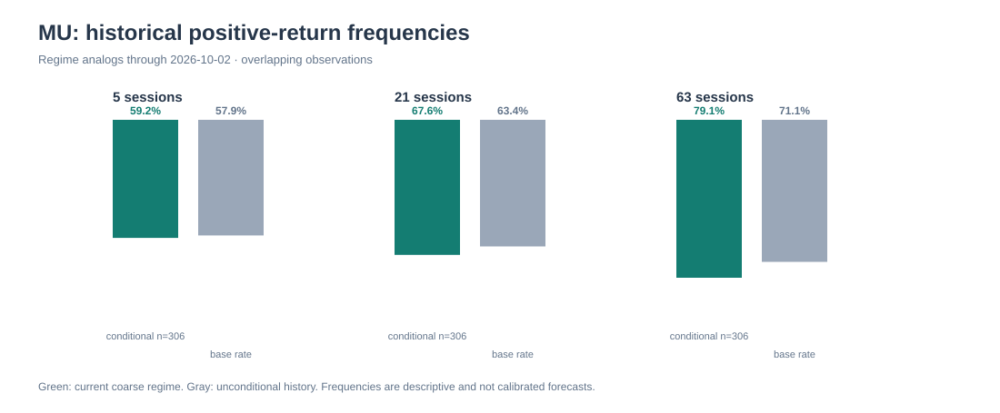

# Watchlist research

NOT PUBLISHED · no observation issued

Final research draft at a closed market: a conditional 63-session market-behavior preference for NVDA over MU is retained, while MU remains a watch despite its stronger near-term GAAP guidance. This is not a valuation ranking: both scenario grids are stipulated total-GAAP EPS/P/E sensitivities, and policy/supply and macro channels remain unquantified. The Challenger identified no objection requiring repair.

## NVDA — conditional_opportunity

NVDA is the conditional 63-session preference because completed-session relative strength and maximum close-path drawdown were better than MU's. The operating case requires AI demand and margins to support earnings without assuming recurring benefit from material other income.

Counter-case: A demand/margin miss, multiple compression amid elevated long yields, or adverse China/export and Taiwan/South Korea supply developments can reverse the trend. NVDA also lagged XLK over 21 sessions.

Valuation: FY2027 grid period is 2026-01-26 to the unverified assumed 2027-01-31, US GAAP, split-adjusted shares. Interim GAAP diluted EPS was $4.85 through 2026-07-26; no management guidance interval is supplied. Stipulated bear/base/bull annual EPS of $8/$10/$12 imply constant-share residual EPS of $3.15/$5.15/$7.15. At hypothetical 18x/24x/30x, price sensitivity is -38.45%/+2.59%/+53.88%; base break-even is $9.7479 EPS holding 24x fixed, or 23.395x holding $10 EPS fixed. Bull gain exceeds absolute bear loss by 15.43pp. This is joint earnings/multiple stress, not a forecast; material other income in the reported anchor means it does not establish recurring operating valuation.

Business — conditional
Reported earnings strength is qualified by material other income and unmeasured demand/margin durability.
Qualification: Next results must distinguish recurring operating realization from non-operating items.

Valuation — conditional
The total-GAAP grid is a stated sensitivity, not observed valuation or fair value.
Qualification: No forward multiple, consensus, verified forward fiscal endpoint, or future-share reconciliation.

Market Behavior — supported
NVDA has the stronger 63-session completed-price record, despite weaker 21-session XLK-relative behavior.
Qualification: Descriptive historical data only, without prediction or causality.

Policy Exposure — conditional
China/export and East-Asian supply are material disclosed channels; a case-by-case rule does not establish access.
Qualification: Current applicability and financial magnitude are unknown.

Relative Preference — conditional
NVDA is conditionally preferred to MU only on the 63-session market-behavior and path-risk comparison.
Qualification: Not a valuation/policy ranking; trend or operating/policy evidence can reverse it.

### Overall assessment

Conditional opportunity: cleaner 63-session completed-price behavior, while valuation, earnings quality and policy conclusions remain qualified.

### Global forces

- Long-yield pressure: A higher discount rate can compress equity multiples before order changes reach earnings. Consequence: Limits the valuation case despite price strength. (evidence: 31e8c68c24968c00d687fe2cf39a20b73cbd3977958680c13d639630726bdb1e, 9a29c528e31690dead1605aa7f2063eaceb74e8fffe80ceb34d8692d3315327f)
- AI demand and earnings quality: Demand/margin realization supports operating EPS, but other income complicates GAAP-to-recurring earnings interpretation. Consequence: Next results may validate or weaken the grid bridge. (evidence: 2f7912d5038b5e78295f571ada35786b456ce1b4b4cdb09c8cc17bf361a3b403, 03ee7a96237d22bd20e4f9d652d9b8d95a6196e30b9145eb5dbb7ddb4595a94c)
- Export controls and overseas supply: Licensing/customer restrictions can constrain demand, while Taiwan/South Korea component continuity affects delivery. Consequence: China is not assumed upside and disruption is downside. (evidence: 9c855856bf42ffe81de12d4d32c496212d7f18febb1a1f8ea988ddabff56e575, a781478fb9520be4d7b4227304759fb0290cc81e2cf25c5684f22b475cb1ed3c, fe8fc370a540af0fa8143a6f50d2c78b932884d2c4040e82690b12af466a7ec9)
- Input and capacity continuity: Raw-material inventories and supplier/component availability can affect production continuity, but cost exposure is unquantified. Consequence: Commodity effects are a review channel, not an EPS deduction. (evidence: d1ce0fa4835d32b20521a845787c62fc857b272d8b268ed5e65a95bfc4af4f5a)

### Conditional outcomes

- bear: If Demand/margins weaken or policy/supply friction rises and the stipulated $8 EPS/18x case applies. → $144 sensitivity, -38.45% from the completed close. Plausibility: Disclosed policy/supply channels and joint multiple risk; no probability assigned. (evidence: a781478fb9520be4d7b4227304759fb0290cc81e2cf25c5684f22b475cb1ed3c, fe8fc370a540af0fa8143a6f50d2c78b932884d2c4040e82690b12af466a7ec9, 03ee7a96237d22bd20e4f9d652d9b8d95a6196e30b9145eb5dbb7ddb4595a94c)
- base: If Stipulated total-GAAP EPS reaches $10 and the selected 24x holds. → $240 sensitivity, +2.59% from the completed close. Plausibility: Explicit sensitivity assumption, not a ranked forecast. (evidence: 03ee7a96237d22bd20e4f9d652d9b8d95a6196e30b9145eb5dbb7ddb4595a94c)
- bull: If Demand/mix durability supports stipulated $12 EPS and selected 30x. → $360 sensitivity, +53.88% from the completed close. Plausibility: Requires simultaneous earnings delivery and multiple expansion; China sales are not assumed. (evidence: a781478fb9520be4d7b4227304759fb0290cc81e2cf25c5684f22b475cb1ed3c, 03ee7a96237d22bd20e4f9d652d9b8d95a6196e30b9145eb5dbb7ddb4595a94c)

### What to consider

For 5/21/63 sessions, consider only a conditional trend-led case; review completed closes, recurring earnings quality, and verified policy/supply news. Do not use the grid as a target or the IEX trade as an executable quote.

### Short summary

NVDA has the cleaner 63-session price/risk record, but its valuation sensitivity depends on total-GAAP earnings with a material non-operating-income qualification and unquantified policy/supply risks.

Assumptions:
- The FY2027 total-GAAP EPS/P/E grid is hypothetical.
- The 2027-01-31 fiscal endpoint is an unverified grid assumption.
- Preference is limited to 63-session market behavior, not valuation or policy superiority.

Review conditions:
- Completed-close review: NVDA below 223.786 (split_adjusted); expires 2027-01-04T21:00:00Z; evidence dates: 2026-10-02 / retrieved 2026-10-04T22:29:49.060113+00:00. A completed split-adjusted SIP close below $223.786 weakens the trend premise behind the conditional preference. — not an executable order.
- Human review: Review on results or verified export/supply disclosure. Weak recurring operating earnings or adverse license/supply evidence weakens the thesis; durable operating results and no material disruption strengthen it.

Claims:
- fact: The applicable market anchors are split-adjusted SIP completed closes on 2026-10-02: NVDA $233.95 and MU $1,074.89. The market was closed at assessment; the refreshed IEX observations are single-venue, stale observations rather than consolidated executable quotes. ([8ba1e7d0cd08](evidence/8ba1e7d0cd08f0c7ebf7aa1d88b646e58f896204d90592da14ee3cce27e6251e.json), [4d9325f33419](evidence/4d9325f33419de0174dcff7a05ad2f0ff3c2a975463e1f6fa7a2e6e25a8c20c8.json), [eb207e89a956](evidence/eb207e89a956b598ff59dcd8a03981474869892557ac970079cc97acffcff262.json), [ba74738d6cbc](evidence/ba74738d6cbcbc1537cfb518d7782006bbd532f85cbbd7c09dbac09177652641.json))
- inference: NVDA has the conditional 63-session market-behavior edge: 19.64% return versus MU's 9.15%, SPY excess of 17.19 versus 6.71 percentage points, XLK excess of 10.79 versus 0.31 points, and a 10.58% versus 25.48% maximum close-path drawdown. MU had stronger 21-session XLK-relative performance, so the comparison is specific to the 63-session window. ([8ba1e7d0cd08](evidence/8ba1e7d0cd08f0c7ebf7aa1d88b646e58f896204d90592da14ee3cce27e6251e.json), [4d9325f33419](evidence/4d9325f33419de0174dcff7a05ad2f0ff3c2a975463e1f6fa7a2e6e25a8c20c8.json), [41b5af8c127c](evidence/41b5af8c127cb70cbafc9662e68862050b6cd25dfdc7bd92914017fae48222e4.json), [6680d710a382](evidence/6680d710a3827a908acf5f69b930f2f3f276ae56dbd33c411a006c10a94f7283.json))
- fact: NVDA reported six-month FY2027 GAAP diluted EPS of $4.85 through 2026-07-26, including $24.14 billion of other income. MU reported FY2026 GAAP diluted EPS of $74.33 and guided FQ1-2027 GAAP diluted EPS to $37.84 plus or minus $1.00. These are distinct reported/guided earnings anchors, not comparable recurring earnings or observed valuations. ([b2c04a88b690](evidence/b2c04a88b6901019d04429682783db5fdd2fe08d407bc6860db3e76bf80bc506.json), [d440498748e5](evidence/d440498748e50e4b2836adf2ca15f6fe42ac84be12e2b6983cbe303902246a0a.json), [2f7912d5038b](evidence/2f7912d5038b5e78295f571ada35786b456ce1b4b4cdb09c8cc17bf361a3b403.json))
- scenario: The stipulated NVDA FY2027 total-GAAP grid produces bear/base/bull changes of -38.45%/+2.59%/+53.88%; MU's stipulated FY2027 grid produces -21.85%/+11.64%/+50.71%. Bull gain exceeds absolute bear loss by 15.43 percentage points for NVDA and 28.86 points for MU, but this mechanical asymmetry is neither a probability, fair value nor cross-stock preference signal. ([03ee7a96237d](evidence/03ee7a96237d22bd20e4f9d652d9b8d95a6196e30b9145eb5dbb7ddb4595a94c.json), [badf18debc1f](evidence/badf18debc1fecdbf50f4d6617ea017be741150810f64bee115914ae3c4526fb.json))
- fact: NVDA discloses effective foreclosure from the China market under export controls and dependence on overseas partners especially in Taiwan and South Korea; the dated rule's case-by-case review does not establish a license. MU discloses potential Section 232/301 tariffs or trade restrictions as possible cost, delay and demand risks. Reviewed evidence does not quantify either issuer's current financial impact. ([9c855856bf42](evidence/9c855856bf42ffe81de12d4d32c496212d7f18febb1a1f8ea988ddabff56e575.json), [e4b2dcc8280e](evidence/e4b2dcc8280e93e46308f4dd64c35269b33ac537176a7e2387a0516367520151.json), [a781478fb952](evidence/a781478fb9520be4d7b4227304759fb0290cc81e2cf25c5684f22b475cb1ed3c.json), [1efbfc4d4275](evidence/1efbfc4d4275d6570d65841cffadec18b7f5a8a70e4e5ecc4ed33b7ceb8cd866.json), [fe8fc370a540](evidence/fe8fc370a540af0fa8143a6f50d2c78b932884d2c4040e82690b12af466a7ec9.json))
- inference: Rising 10-year yields, unchanged fed funds, technology strength, and weaker IWM/HYG behavior form a mixed proxy backdrop. Therefore, NVDA/MU leadership is treated as stock-specific completed-price behavior rather than broad risk-on confirmation or causal macro evidence. ([0f4702583d67](evidence/0f4702583d67cd3f7a1b5b8fc270dbd3f44522abe29d7c418c37fec7893d4308.json), [4ce6c5b0849f](evidence/4ce6c5b0849f3b6b649dcc72b5c9ad4d34b1bdc6ce6f25b37ff07b5f81f446f3.json), [3619544e016f](evidence/3619544e016f1c24f3b92da790e0cda23730387072f05b55cb587e61a6b67bfd.json), [31e8c68c2496](evidence/31e8c68c24968c00d687fe2cf39a20b73cbd3977958680c13d639630726bdb1e.json), [9a29c528e316](evidence/9a29c528e31690dead1605aa7f2063eaceb74e8fffe80ceb34d8692d3315327f.json), [20fc8fb218a7](evidence/20fc8fb218a7c70d61bd344f9618ee4c3c5b6ccfcf80823387f19fd8e8838749.json))
- inference: A limited conditional preference for NVDA over MU is supported only by the 63-session relative-return and path-risk comparison. MU's clearer guided near-term operating bridge does not overturn that market-behavior comparison, and no valuation or policy superiority is asserted. ([41b5af8c127c](evidence/41b5af8c127cb70cbafc9662e68862050b6cd25dfdc7bd92914017fae48222e4.json), [6680d710a382](evidence/6680d710a3827a908acf5f69b930f2f3f276ae56dbd33c411a006c10a94f7283.json), [b2c04a88b690](evidence/b2c04a88b6901019d04429682783db5fdd2fe08d407bc6860db3e76bf80bc506.json), [2f7912d5038b](evidence/2f7912d5038b5e78295f571ada35786b456ce1b4b4cdb09c8cc17bf361a3b403.json))

## MU — watch

MU's FY2026 result and explicit FQ1-2027 GAAP outlook provide a clearer near-term operating bridge than NVDA's, but continuation requires AI-memory demand, pricing and exceptional margins to persist while its observed 63-session path risk remains materially greater.

Counter-case: Guidance and margins may persist and positive 21/63-session relative performance can reaccelerate. Yet five-session lag, high historical volatility and memory-cycle normalization mean that operating and price confirmation are needed.

Valuation: FY2027 grid period is 2026-09-04 to the unverified assumed 2027-09-02, US GAAP, split-adjusted shares. FY2026 GAAP diluted EPS was $74.33; FQ1-2027 GAAP guidance is $37.84 +/- $1.00. Holding the $37.84 midpoint fixed, stipulated annual EPS of $120/$150/$180 require residual $82.16/$112.16/$142.16 over the remaining three quarters, a non-exact bridge because future diluted shares are unknown. At hypothetical 7x/8x/9x, sensitivity is -21.85%/+11.64%/+50.71%; base break-even is $134.3613 EPS holding 8x fixed, or 7.1659x holding $150 EPS fixed. Bull gain exceeds absolute bear loss by 28.86pp. These are joint earnings/multiple stresses, not forecasts, probabilities, or fair values.

Business — conditional
FY2026 results and FQ1 guidance support a strong near-term backdrop, but remaining-year pricing and margin durability are unproven.
Qualification: Memory supply response and customer demand determine whether the bridge holds.

Valuation — conditional
The grid frames cycle sensitivity but does not establish observed valuation.
Qualification: No observed forward P/E, consensus, verified forward fiscal endpoint, or future-share reconciliation.

Market Behavior — supported
Positive 21/63-session momentum coexists with five-session lag and materially higher volatility/drawdown than NVDA.
Qualification: Descriptive completed-session evidence only.

Policy Exposure — conditional
Potential Section 232/301 trade measures are disclosed channels for costs, delays or demand.
Qualification: Final applicability and financial impact are unknown.

Relative Preference — conditional
MU is not preferred to NVDA on supplied 63-session price and path-risk evidence despite its stronger guided near-term bridge.
Qualification: Not a valuation ranking and can reverse with sustained earnings and technical leadership.

### Overall assessment

Watch: operating results and guidance are strong, but the continuation case requires unusually high memory margins and pricing to persist amid greater observed path risk.

### Global forces

- AI-memory demand, pricing and supply discipline: Demand/mix and supply response determine realized prices and margins. Consequence: Determines whether the remaining-three-quarter EPS bridge is sustainable. (evidence: b2c04a88b6901019d04429682783db5fdd2fe08d407bc6860db3e76bf80bc506, badf18debc1fecdbf50f4d6617ea017be741150810f64bee115914ae3c4526fb)
- Long yields and a mixed risk backdrop: Multiple repricing can precede demand effects; mixed proxies do not identify a macro regime. Consequence: Do not extrapolate price strength into a macro demand forecast. (evidence: 4ce6c5b0849f3b6b649dcc72b5c9ad4d34b1bdc6ce6f25b37ff07b5f81f446f3, 3619544e016f1c24f3b92da790e0cda23730387072f05b55cb587e61a6b67bfd, 31e8c68c24968c00d687fe2cf39a20b73cbd3977958680c13d639630726bdb1e, 9a29c528e31690dead1605aa7f2063eaceb74e8fffe80ceb34d8692d3315327f)
- Trade restrictions: Potential tariffs or restrictions can raise costs, delay manufacturing, or reduce demand. Consequence: Contingent downside without an evidenced EPS deduction. (evidence: e4b2dcc8280e93e46308f4dd64c35269b33ac537176a7e2387a0516367520151)
- Materials and fabrication capacity: Raw-material inventory and capex/facility commitments indicate operational dependence, but no commodity-cost share is supplied. Consequence: Monitor disruption and cost pass-through rather than infer an oil or metals beta. (evidence: a81e27c7b2d98ce5b1b165dd088f38edb268d5b1b225dd13f57ea706f0eae690)

### Conditional outcomes

- bear: If Memory pricing/supply normalizes margins and the stipulated $120 EPS/7x case applies. → $840 sensitivity, -21.85% from the completed close. Plausibility: Cycle and trade-risk channels are disclosed; no probability assigned. (evidence: e4b2dcc8280e93e46308f4dd64c35269b33ac537176a7e2387a0516367520151, badf18debc1fecdbf50f4d6617ea017be741150810f64bee115914ae3c4526fb)
- base: If The FQ1 midpoint is held and stipulated FY2027 EPS reaches $150 at 8x. → $1,200 sensitivity, +11.64% from the completed close. Plausibility: Stipulated sensitivity, not a prediction; remaining-year durability is unverified. (evidence: b2c04a88b6901019d04429682783db5fdd2fe08d407bc6860db3e76bf80bc506, badf18debc1fecdbf50f4d6617ea017be741150810f64bee115914ae3c4526fb)
- bull: If AI-memory demand, pricing and margins persist, supporting stipulated $180 EPS at 9x. → $1,620 sensitivity, +50.71% from the completed close. Plausibility: Requires continuation beyond guided Q1 and multiple expansion. (evidence: b2c04a88b6901019d04429682783db5fdd2fe08d407bc6860db3e76bf80bc506, badf18debc1fecdbf50f4d6617ea017be741150810f64bee115914ae3c4526fb)

### What to consider

For 5/21/63 sessions, wait for confirmation that subsequent EPS/gross-margin outlook and relative-price leadership offset the higher observed path risk. Treat the grid as conditional sensitivity, not an executable target.

### Short summary

MU has strong operating momentum and clear near-term guidance, but it is the higher-volatility, more cycle-dependent case and remains a watch.

Assumptions:
- FY2027 total-GAAP EPS/P/E inputs are hypothetical.
- The FQ1 guidance midpoint is held fixed in the simple annual bridge; future diluted shares are unknown.
- Trade and commodity channels are conditional and unquantified.

Review conditions:
- Completed-close review: MU below 1025.0015 (split_adjusted); expires 2027-01-04T21:00:00Z; evidence dates: 2026-10-02 / retrieved 2026-10-04T22:29:48.107987+00:00. A completed split-adjusted SIP close below $1025.0015 weakens the rising-trend setup and elevates path-risk concerns. — not an executable order.
- Human review: Review next earnings if GAAP EPS or gross-margin outlook changes materially from FQ1 guidance. Weaker pricing/margin guidance weakens the annual bridge; sustained guidance strengthens it.

Claims:
- fact: The applicable market anchors are split-adjusted SIP completed closes on 2026-10-02: NVDA $233.95 and MU $1,074.89. The market was closed at assessment; the refreshed IEX observations are single-venue, stale observations rather than consolidated executable quotes. ([8ba1e7d0cd08](evidence/8ba1e7d0cd08f0c7ebf7aa1d88b646e58f896204d90592da14ee3cce27e6251e.json), [4d9325f33419](evidence/4d9325f33419de0174dcff7a05ad2f0ff3c2a975463e1f6fa7a2e6e25a8c20c8.json), [eb207e89a956](evidence/eb207e89a956b598ff59dcd8a03981474869892557ac970079cc97acffcff262.json), [ba74738d6cbc](evidence/ba74738d6cbcbc1537cfb518d7782006bbd532f85cbbd7c09dbac09177652641.json))
- inference: NVDA has the conditional 63-session market-behavior edge: 19.64% return versus MU's 9.15%, SPY excess of 17.19 versus 6.71 percentage points, XLK excess of 10.79 versus 0.31 points, and a 10.58% versus 25.48% maximum close-path drawdown. MU had stronger 21-session XLK-relative performance, so the comparison is specific to the 63-session window. ([8ba1e7d0cd08](evidence/8ba1e7d0cd08f0c7ebf7aa1d88b646e58f896204d90592da14ee3cce27e6251e.json), [4d9325f33419](evidence/4d9325f33419de0174dcff7a05ad2f0ff3c2a975463e1f6fa7a2e6e25a8c20c8.json), [41b5af8c127c](evidence/41b5af8c127cb70cbafc9662e68862050b6cd25dfdc7bd92914017fae48222e4.json), [6680d710a382](evidence/6680d710a3827a908acf5f69b930f2f3f276ae56dbd33c411a006c10a94f7283.json))
- fact: NVDA reported six-month FY2027 GAAP diluted EPS of $4.85 through 2026-07-26, including $24.14 billion of other income. MU reported FY2026 GAAP diluted EPS of $74.33 and guided FQ1-2027 GAAP diluted EPS to $37.84 plus or minus $1.00. These are distinct reported/guided earnings anchors, not comparable recurring earnings or observed valuations. ([b2c04a88b690](evidence/b2c04a88b6901019d04429682783db5fdd2fe08d407bc6860db3e76bf80bc506.json), [d440498748e5](evidence/d440498748e50e4b2836adf2ca15f6fe42ac84be12e2b6983cbe303902246a0a.json), [2f7912d5038b](evidence/2f7912d5038b5e78295f571ada35786b456ce1b4b4cdb09c8cc17bf361a3b403.json))
- scenario: The stipulated NVDA FY2027 total-GAAP grid produces bear/base/bull changes of -38.45%/+2.59%/+53.88%; MU's stipulated FY2027 grid produces -21.85%/+11.64%/+50.71%. Bull gain exceeds absolute bear loss by 15.43 percentage points for NVDA and 28.86 points for MU, but this mechanical asymmetry is neither a probability, fair value nor cross-stock preference signal. ([03ee7a96237d](evidence/03ee7a96237d22bd20e4f9d652d9b8d95a6196e30b9145eb5dbb7ddb4595a94c.json), [badf18debc1f](evidence/badf18debc1fecdbf50f4d6617ea017be741150810f64bee115914ae3c4526fb.json))
- fact: NVDA discloses effective foreclosure from the China market under export controls and dependence on overseas partners especially in Taiwan and South Korea; the dated rule's case-by-case review does not establish a license. MU discloses potential Section 232/301 tariffs or trade restrictions as possible cost, delay and demand risks. Reviewed evidence does not quantify either issuer's current financial impact. ([9c855856bf42](evidence/9c855856bf42ffe81de12d4d32c496212d7f18febb1a1f8ea988ddabff56e575.json), [e4b2dcc8280e](evidence/e4b2dcc8280e93e46308f4dd64c35269b33ac537176a7e2387a0516367520151.json), [a781478fb952](evidence/a781478fb9520be4d7b4227304759fb0290cc81e2cf25c5684f22b475cb1ed3c.json), [1efbfc4d4275](evidence/1efbfc4d4275d6570d65841cffadec18b7f5a8a70e4e5ecc4ed33b7ceb8cd866.json), [fe8fc370a540](evidence/fe8fc370a540af0fa8143a6f50d2c78b932884d2c4040e82690b12af466a7ec9.json))
- inference: Rising 10-year yields, unchanged fed funds, technology strength, and weaker IWM/HYG behavior form a mixed proxy backdrop. Therefore, NVDA/MU leadership is treated as stock-specific completed-price behavior rather than broad risk-on confirmation or causal macro evidence. ([0f4702583d67](evidence/0f4702583d67cd3f7a1b5b8fc270dbd3f44522abe29d7c418c37fec7893d4308.json), [4ce6c5b0849f](evidence/4ce6c5b0849f3b6b649dcc72b5c9ad4d34b1bdc6ce6f25b37ff07b5f81f446f3.json), [3619544e016f](evidence/3619544e016f1c24f3b92da790e0cda23730387072f05b55cb587e61a6b67bfd.json), [31e8c68c2496](evidence/31e8c68c24968c00d687fe2cf39a20b73cbd3977958680c13d639630726bdb1e.json), [9a29c528e316](evidence/9a29c528e31690dead1605aa7f2063eaceb74e8fffe80ceb34d8692d3315327f.json), [20fc8fb218a7](evidence/20fc8fb218a7c70d61bd344f9618ee4c3c5b6ccfcf80823387f19fd8e8838749.json))
- inference: A limited conditional preference for NVDA over MU is supported only by the 63-session relative-return and path-risk comparison. MU's clearer guided near-term operating bridge does not overturn that market-behavior comparison, and no valuation or policy superiority is asserted. ([41b5af8c127c](evidence/41b5af8c127cb70cbafc9662e68862050b6cd25dfdc7bd92914017fae48222e4.json), [6680d710a382](evidence/6680d710a3827a908acf5f69b930f2f3f276ae56dbd33c411a006c10a94f7283.json), [b2c04a88b690](evidence/b2c04a88b6901019d04429682783db5fdd2fe08d407bc6860db3e76bf80bc506.json), [2f7912d5038b](evidence/2f7912d5038b5e78295f571ada35786b456ce1b4b4cdb09c8cc17bf361a3b403.json))

## Shared exposures

- Both have semiconductor trade/supply-friction channels and are exposed to macro multiple pressure, though their mechanisms and magnitudes differ. — Dated disclosures establish channels, not equal exposure weights, current financial impact, or portfolio correlation.

## Role coverage

- company: completed — Issuer earnings anchors and deterministic company sensitivities completed.
- macro: completed — Rates/proxy and competing transmission analysis completed.
- technical: completed — Matched-window trend, path-risk and historical-regime analysis completed.
- geopolitics: completed — Dated policy and issuer-disclosure channel analysis completed.
- commodities: completed — Input, supply and capacity channel review completed; no quantified cost exposure found.

## Evidence gaps

- NVDA,MU: There is no observed forward P/E, consensus EPS, verified forward fiscal endpoint, or future diluted-share reconciliation. This prevents an unconditional valuation or relative-value ranking but does not invalidate explicitly hypothetical sensitivities.
- NVDA,MU: Current licenses, product eligibility, geographic revenue/sourcing and issuer-specific financial sensitivity to export/trade measures are unquantified. This limits sizing policy effects, not the disclosed conditional channels.
- NVDA,MU: No evidenced issuer input-cost share, commodity hedge/pass-through, or current power/material disruption permits a quantified commodity impact conclusion.

## Question effects

- question-1 / changed: Company evidence distinguishes NVDA accelerated-computing demand/margin dependence from MU AI-memory pricing, supply and margin durability, refining the macro transmission mechanisms.
- question-2 / changed: Mixed rate and cross-asset proxy evidence means the 63-session technical comparison remains stock-specific rather than broad risk-on confirmation.

## Challenge dispositions

## Limitations

- Unpublished research; publication refresh, conditions evaluation and outcome scoring belong to M3.
- Market context uses only the frozen benchmark list; watchlist diagnostics are not market breadth.
- Source dates and missingness remain explicit. Scenario valuations are assumptions, not price targets or calibrated forecasts.
- Catalog cost is estimated; provider output-token and cost ceilings may be enforced after a response.

### Deterministic technical charts

Comparison panel: [recorded evidence](evidence/41b5af8c127cb70cbafc9662e68862050b6cd25dfdc7bd92914017fae48222e4.json). Positive is instrument outperformance; negative is underperformance.

Price evidence: [MU](evidence/8ba1e7d0cd08f0c7ebf7aa1d88b646e58f896204d90592da14ee3cce27e6251e.json), [NVDA](evidence/4d9325f33419de0174dcff7a05ad2f0ff3c2a975463e1f6fa7a2e6e25a8c20c8.json).

Historical overlapping forward-return frequencies conditional on three coarse price-regime signs. Samples are dependent, selected from one finite lookback, and are not calibrated probabilities, causal estimates, or guarantees. Report sample size and unconditional base rate alongside them.

The indexed paths use archived OHLCV only through the normalized completed close; later/unfinished bars are excluded. The summary comparison and risk charts use the same admitted cutoff. These are historical observations, not forecasts or executable quotes.

## Validated numerical evidence

Values below come directly from stored evidence. Open each source for full lineage and fields.

### [sec-submissions-MU](evidence/45e462a16cda5cd7ea4a1517d76b24ebf58efe85798e1fb62d6edc25cda44b90.json)

Full normalized fields are available through the evidence link.

### [sec-submissions-NVDA](evidence/2859daf4ea287039e5c0a41ec0a61199745bf94c2bf89b188dd937f86142544b.json)

Full normalized fields are available through the evidence link.

### [sec-facts-MU](evidence/7ab10dcbb8b053ea9925664abc65abdd5b83cbe47cba844822e288ecade16cb4.json)

| Metric | Value | Unit | Period start | Period end | Filed |
|---|---:|---|---|---|---|
| revenue (RevenueFromContractWithCustomerExcludingAssessedTax) | 78959000000 | USD | 2025-08-29 | 2026-05-28 | 2026-06-25 |
| net_income (NetIncomeLoss) | 47268000000 | USD | 2025-08-29 | 2026-05-28 | 2026-06-25 |
| operating_income (OperatingIncomeLoss) | 55589000000 | USD | 2025-08-29 | 2026-05-28 | 2026-06-25 |
| operating_cash_flow (NetCashProvidedByUsedInOperatingActivities) | 45702000000 | USD | 2025-08-29 | 2026-05-28 | 2026-06-25 |
| capital_expenditure (PaymentsToAcquirePropertyPlantAndEquipment) | 19602000000 | USD | 2025-08-29 | 2026-05-28 | 2026-06-25 |
| assets (Assets) | 134112000000 | USD | instant | 2026-05-28 | 2026-06-25 |
| liabilities (Liabilities) | 33388000000 | USD | instant | 2026-05-28 | 2026-06-25 |
| equity (StockholdersEquity) | 100724000000 | USD | instant | 2026-05-28 | 2026-06-25 |
| cash (CashAndCashEquivalentsAtCarryingValue) | 24995000000 | USD | instant | 2026-05-28 | 2026-06-25 |
| diluted_eps (EarningsPerShareDiluted) | 41.4 | USD/shares | 2025-08-29 | 2026-05-28 | 2026-06-25 |
| shares_outstanding (CommonStockSharesOutstanding) | 1129000000 | shares | instant | 2026-05-28 | 2026-06-25 |
| annual diluted EPS anchor | 7.59 | USD/shares | 2024-08-30 | 2025-08-28 | 2025-10-03 |
| annual diluted EPS anchor | 0.7 | USD/shares | 2023-09-01 | 2024-08-29 | 2025-10-03 |
| annual diluted EPS anchor | -5.34 | USD/shares | 2022-09-02 | 2023-08-31 | 2025-10-03 |

Fiscal durations are not silently annualized; debt concepts may cover only current maturities.

### [sec-facts-NVDA](evidence/838e4b772b2b506c06efb41fb3de6f04eac57ef8a1e6a02198cd531230a84d35.json)

| Metric | Value | Unit | Period start | Period end | Filed |
|---|---:|---|---|---|---|
| revenue (Revenues) | 177837000000 | USD | 2026-01-26 | 2026-07-26 | 2026-08-26 |
| net_income (NetIncomeLoss) | 118010000000 | USD | 2026-01-26 | 2026-07-26 | 2026-08-26 |
| operating_income (OperatingIncomeLoss) | 117270000000 | USD | 2026-01-26 | 2026-07-26 | 2026-08-26 |
| operating_cash_flow (NetCashProvidedByUsedInOperatingActivities) | 74421000000 | USD | 2026-01-26 | 2026-07-26 | 2026-08-26 |
| assets (Assets) | 320272000000 | USD | instant | 2026-07-26 | 2026-08-26 |
| liabilities (Liabilities) | 91288000000 | USD | instant | 2026-07-26 | 2026-08-26 |
| equity (StockholdersEquity) | 228984000000 | USD | instant | 2026-07-26 | 2026-08-26 |
| cash (CashAndCashEquivalentsAtCarryingValue) | 22443000000 | USD | instant | 2026-07-26 | 2026-08-26 |
| long_term_debt (LongTermDebtCurrent) | 1000000000 | USD | instant | 2026-07-26 | 2026-08-26 |
| diluted_eps (EarningsPerShareDiluted) | 4.85 | USD/shares | 2026-01-26 | 2026-07-26 | 2026-08-26 |
| shares_outstanding (CommonStockSharesOutstanding) | 24304000000 | shares | instant | 2026-01-25 | 2026-02-25 |
| annual diluted EPS anchor | 4.9 | USD/shares | 2025-01-27 | 2026-01-25 | 2026-02-25 |
| annual diluted EPS anchor | 2.94 | USD/shares | 2024-01-29 | 2025-01-26 | 2026-02-25 |
| annual diluted EPS anchor | 1.19 | USD/shares | 2023-01-30 | 2024-01-28 | 2026-02-25 |

Fiscal durations are not silently annualized; debt concepts may cover only current maturities.

### [price-MU](evidence/8ba1e7d0cd08f0c7ebf7aa1d88b646e58f896204d90592da14ee3cce27e6251e.json)

MU · 2026-10-02 · FRESH · sip · split_adjusted · price return

| Metric | Recorded value |
|---|---:|
| latest_close | 1074.89 |
| sma20 | 1025.0014999999999 |
| sma50 | 956.0457000000001 |
| sma200 | 681.614275 |
| rsi14_simple | 74.88453417788335 |
| return5_pct | -0.6828177551095771 |
| return21_pct | 12.426784369508837 |
| return63_pct | 9.153592282305167 |
| realized_vol63_pct | 74.562367571875 |

### [price-NVDA](evidence/4d9325f33419de0174dcff7a05ad2f0ff3c2a975463e1f6fa7a2e6e25a8c20c8.json)

NVDA · 2026-10-02 · FRESH · sip · split_adjusted · price return

| Metric | Recorded value |
|---|---:|
| latest_close | 233.95 |
| sma20 | 223.78599999999997 |
| sma50 | 218.2782 |
| sma200 | 200.7146 |
| rsi14_simple | 82.96529968454259 |
| return5_pct | 3.945439196694367 |
| return21_pct | 4.251147453322046 |
| return63_pct | 19.6369215034518 |
| realized_vol63_pct | 38.247306474537 |

### [price-SPY](evidence/27247b8314578b3c8d354217bfb95264e1745693a787b72cb7bb255e06e18333.json)

SPY · 2026-10-02 · FRESH · sip · split_adjusted · price return

| Metric | Recorded value |
|---|---:|
| latest_close | 769.64 |
| sma20 | 764.8285 |
| sma50 | 763.7021999999998 |
| sma200 | 720.471 |
| rsi14_simple | 58.063328424153134 |
| return5_pct | -0.22168924612692154 |
| return21_pct | 0.5854984578388844 |
| return63_pct | 2.443829198168457 |
| realized_vol63_pct | 11.003568230609359 |

### [price-XLK](evidence/0f4702583d67cd3f7a1b5b8fc270dbd3f44522abe29d7c418c37fec7893d4308.json)

XLK · 2026-10-02 · FRESH · sip · split_adjusted · price return

| Metric | Recorded value |
|---|---:|
| latest_close | 199.81 |
| sma20 | 191.26799999999997 |
| sma50 | 186.30219999999997 |
| sma200 | 164.94025000000002 |
| rsi14_simple | 83.36914482165878 |
| return5_pct | 1.8036378458246238 |
| return21_pct | 8.828976034858393 |
| return63_pct | 8.846761453396535 |
| realized_vol63_pct | 25.813718764085717 |

### [price-IWM](evidence/4ce6c5b0849f3b6b649dcc72b5c9ad4d34b1bdc6ce6f25b37ff07b5f81f446f3.json)

IWM · 2026-10-02 · FRESH · sip · split_adjusted · price return

| Metric | Recorded value |
|---|---:|
| latest_close | 281.52 |
| sma20 | 285.01050000000004 |
| sma50 | 292.57660000000004 |
| sma200 | 276.32 |
| rsi14_simple | 36.41003828158218 |
| return5_pct | -0.15959144589852148 |
| return21_pct | -4.2481548246658285 |
| return63_pct | -5.814653730344599 |
| realized_vol63_pct | 13.302869011351902 |

### [price-HYG](evidence/3619544e016f1c24f3b92da790e0cda23730387072f05b55cb587e61a6b67bfd.json)

HYG · 2026-10-02 · FRESH · sip · split_adjusted · price return

| Metric | Recorded value |
|---|---:|
| latest_close | 76.91 |
| sma20 | 78.20900000000002 |
| sma50 | 79.00439999999999 |
| sma200 | 79.88575 |
| rsi14_simple | 19.083969465648835 |
| return5_pct | -1.2201387105060357 |
| return21_pct | -2.7809379345215546 |
| return63_pct | -3.706022286215105 |
| realized_vol63_pct | 3.618912741128176 |

### [fred-DGS10](evidence/31e8c68c24968c00d687fe2cf39a20b73cbd3977958680c13d639630726bdb1e.json)

Full normalized fields are available through the evidence link.

### [fred-DFF](evidence/9a29c528e31690dead1605aa7f2063eaceb74e8fffe80ceb34d8692d3315327f.json)

Full normalized fields are available through the evidence link.

### [price-EEM](evidence/de5714408e996c3ae56c639d458d5a630d3e3964d4fa2454cdbe25ea6b23f0a0.json)

EEM · 2026-10-02 · FRESH · sip · split_adjusted · price return

| Metric | Recorded value |
|---|---:|
| latest_close | 67.67 |
| sma20 | 67.45 |
| sma50 | 66.4062 |
| sma200 | 62.99459999999999 |
| rsi14_simple | 59.65517241379315 |
| return5_pct | -0.4560164754339513 |
| return21_pct | 0.7743857036485391 |
| return63_pct | 0.14799467219182016 |
| realized_vol63_pct | 23.810079464291785 |

### [price-EFA](evidence/ecc05a7f9431514ebf30ecf6c4d3c1fe02b4cc0d6967d857a92db999adb30f4d.json)

EFA · 2026-10-02 · FRESH · sip · split_adjusted · price return

| Metric | Recorded value |
|---|---:|
| latest_close | 103.96 |
| sma20 | 105.50250000000001 |
| sma50 | 106.48179999999998 |
| sma200 | 102.5934 |
| rsi14_simple | 41.70324846356455 |
| return5_pct | -1.5157256536566965 |
| return21_pct | -2.895572576125549 |
| return63_pct | -1.4223402237815264 |
| realized_vol63_pct | 12.973522482614543 |

### [price-GLD](evidence/061ea178ebdb4b48f44563dfade665bb2917e697ed2e3405a00e852a06315a91.json)

GLD · 2026-10-02 · FRESH · sip · split_adjusted · price return

| Metric | Recorded value |
|---|---:|
| latest_close | 380.14 |
| sma20 | 393.21000000000004 |
| sma50 | 396.2926 |
| sma200 | 416.1553 |
| rsi14_simple | 38.412408759124105 |
| return5_pct | -3.3730713504994903 |
| return21_pct | -5.620934505188934 |
| return63_pct | -0.5207651846230399 |
| realized_vol63_pct | 24.520184041141334 |

### [price-USO](evidence/a11696de0a0f2a4af9176a3704fe61e3392d4cc8ca8e7d2479b5794f641c525c.json)

USO · 2026-10-02 · FRESH · sip · split_adjusted · price return

| Metric | Recorded value |
|---|---:|
| latest_close | 147.37 |
| sma20 | 150.69799999999998 |
| sma50 | 137.367 |
| sma200 | 115.17275000000001 |
| rsi14_simple | 41.462966366476756 |
| return5_pct | -0.6472055551810185 |
| return21_pct | 4.406659582004968 |
| return63_pct | 41.22664111164352 |
| realized_vol63_pct | 52.26962981867283 |

### [price-UUP](evidence/20fc8fb218a7c70d61bd344f9618ee4c3c5b6ccfcf80823387f19fd8e8838749.json)

UUP · 2026-10-02 · FRESH · sip · split_adjusted · price return

| Metric | Recorded value |
|---|---:|
| latest_close | 28.89 |
| sma20 | 28.434999999999995 |
| sma50 | 28.264 |
| sma200 | 27.755 |
| rsi14_simple | 84.61538461538458 |
| return5_pct | 0.943396226415083 |
| return21_pct | 2.555910543130979 |
| return63_pct | 2.012711864406791 |
| realized_vol63_pct | 5.19374796161255 |

### [snapshot-NVDA](evidence/dbf555a6f029a995146b9c3150743857192e77a67710f650544b6775d09f5d28.json)

Full normalized fields are available through the evidence link.

### [snapshot-MU](evidence/0a1909199030ac8a6754f6c8b9756e0a7f386b466355f6099f0eb2469d80be50.json)

Full normalized fields are available through the evidence link.

### [41b5af8c127c](evidence/41b5af8c127cb70cbafc9662e68862050b6cd25dfdc7bd92914017fae48222e4.json)

| Symbol | Benchmark | Date | Status | Excess 5 / 21 / 63 sessions (pp) |
|---|---|---|---|---:|
| NVDA | SPY | 2026-10-02 | FRESH | 4.16712844282128854 / 3.6656489954831616 / 17.193092305283343 |
| NVDA | XLK | 2026-10-02 | FRESH | 2.1418013508697432 / -4.577828581536347 / 10.790160050055265 |
| MU | SPY | 2026-10-02 | FRESH | -0.46112850898265556 / 11.8412859116699526 / 6.709763084136710 |
| MU | XLK | 2026-10-02 | FRESH | -2.4864556009342009 / 3.597808334650444 / 0.306830828908632 |

Comparison gaps: `[]`

### [6680d710a382](evidence/6680d710a3827a908acf5f69b930f2f3f276ae56dbd33c411a006c10a94f7283.json)

Full normalized fields are available through the evidence link.

### MU historical forward-return frequencies

As of 2026-10-02 · analog window 2023-12-18 to 2026-07-06

Current regime: `{"close_above_sma20": true, "return21_positive": true, "sma20_above_sma50": true}`

| Horizon | Conditional n | Positive frequency | Median | 10th / 90th pct | Unconditional positive frequency |
|---:|---:|---:|---:|---:|---:|
| 5 | 306 | 59.1503% | 2.3528% | -8.3105% / 16.4845% | 57.9278% (n=637) |
| 21 | 306 | 67.6471% | 5.9775% | -11.2838% / 39.6348% | 63.4223% (n=637) |
| 63 | 306 | 79.0850% | 31.8158% | -15.9730% / 81.1562% | 71.1146% (n=637) |

Historical overlapping forward-return frequencies conditional on three coarse price-regime signs. Samples are dependent, selected from one finite lookback, and are not calibrated probabilities, causal estimates, or guarantees. Report sample size and unconditional base rate alongside them.

### NVDA historical forward-return frequencies

As of 2026-10-02 · analog window 2023-12-18 to 2026-07-06

Current regime: `{"close_above_sma20": true, "return21_positive": true, "sma20_above_sma50": true}`

| Horizon | Conditional n | Positive frequency | Median | 10th / 90th pct | Unconditional positive frequency |
|---:|---:|---:|---:|---:|---:|
| 5 | 265 | 58.1132% | 1.1444% | -5.5420% / 8.8401% | 58.8697% (n=637) |
| 21 | 265 | 58.4906% | 3.6880% | -9.8039% / 25.9386% | 61.6954% (n=637) |
| 63 | 265 | 71.6981% | 10.9767% | -8.4506% / 40.1616% | 73.4694% (n=637) |

Historical overlapping forward-return frequencies conditional on three coarse price-regime signs. Samples are dependent, selected from one finite lookback, and are not calibrated probabilities, causal estimates, or guarantees. Report sample size and unconditional base rate alongside them.

### NVDA conditional valuation sensitivity

Assumed earnings period: 2026-01-26 to 2027-01-31 · US_GAAP · split_adjusted

Reference close: 233.95 on 2026-10-02

| Case | Assumed EPS | Assumed P/E | Scenario price | Change from dated close (%) |
|---|---:|---:|---:|---:|
| bear | 8.00 | 18.00 | 144.0000 | -38.44838640735199829023295575977773028425 |
| base | 10.00 | 24.00 | 240.0000 | 2.586022654413336182945073733703782859600 |
| bull | 12.00 | 30.00 | 360.0000 | 53.87903398162000427441761060055567428940 |

Hypothetical full-fiscal-2027 total-GAAP diluted EPS sensitivity. The six months ended 2026-07-26 reported diluted EPS of 4.85; bear/base/bull EPS assumptions of 8.00/10.00/12.00 imply 3.15/5.15/7.15 of total-GAAP EPS in the remaining period under a constant-share approximation. The period end is an unverified assumed fiscal endpoint, not a disclosed fiscal calendar. The anchor includes material other income, including equity-security gains; therefore these are not recurring operating-EPS forecasts and hold unforecasted non-operating items only implicitly within total-GAAP EPS assumptions. P/E multiples of 18/24/30 are hypothetical stress inputs, not observed multiples, consensus, fair values, or probability-weighted estimates.

All EPS and P/E inputs are analyst assumptions, not observed multiples or consensus. Prices are conditional sensitivities, not forecasts, probabilities or executable quotes. The earnings period differs from the research horizon; assumption and share-basis suitability require review.

- bear: Hypothetical total-GAAP miss: lower remaining-period EPS plus multiple compression, testing weaker AI demand or margin realization while not attributing unforecasted non-operating income to operations.
- base: Hypothetical total-GAAP continuation case: remaining-period EPS supports a full-year total-GAAP figure of 10.00 under constant shares; multiple held at a selected stress input.
- bull: Hypothetical total-GAAP beat: stronger remaining-period EPS and multiple expansion, testing demand/mix durability; it does not forecast gains from equity securities.
### MU conditional valuation sensitivity

Assumed earnings period: 2026-09-04 to 2027-09-02 · US_GAAP · split_adjusted

Reference close: 1074.89 on 2026-10-02

| Case | Assumed EPS | Assumed P/E | Scenario price | Change from dated close (%) |
|---|---:|---:|---:|---:|
| bear | 120.00 | 7.00 | 840.0000 | -21.85246862469648057010484793792853222190 |
| base | 150.00 | 8.00 | 1200.0000 | 11.63933053614788489985021723153066825440 |
| bull | 180.00 | 9.00 | 1620.0000 | 50.71309622379964461479779326256640214350 |

Hypothetical fiscal-2027 total-GAAP diluted-EPS sensitivity. Fiscal 2026 ended 2026-09-03 and reported GAAP diluted EPS of 74.33. Management guided fiscal Q1 2027 GAAP diluted EPS to 37.84 +/- 1.00; bear/base/bull annual EPS assumptions of 120.00/150.00/180.00 therefore require 82.16/112.16/142.16 across the remaining three quarters after holding the guided midpoint fixed, a simple quarterly EPS bridge that is not exact because future diluted shares are unknown. The fiscal end is an unverified one-year assumption, not a disclosed calendar. P/E inputs of 7/8/9 are hypothetical stresses, not observed multiples, consensus, fair values or probabilities. Assumptions test memory pricing and AI-memory demand/margin durability versus cycle normalization; no forward consensus is supplied.

All EPS and P/E inputs are analyst assumptions, not observed multiples or consensus. Prices are conditional sensitivities, not forecasts, probabilities or executable quotes. The earnings period differs from the research horizon; assumption and share-basis suitability require review.

- bear: Hypothetical total-GAAP miss: after Q1 guidance midpoint, remaining-period EPS of 82.16 tests weaker memory pricing, supply response or margin normalization, coupled with multiple compression.
- base: Hypothetical total-GAAP continuation: after Q1 guidance midpoint, remaining-period EPS of 112.16 tests sustained AI-memory demand and high margins, with a selected stress multiple held fixed.
- bull: Hypothetical total-GAAP beat: after Q1 guidance midpoint, remaining-period EPS of 142.16 tests stronger demand/mix and pricing persistence plus multiple expansion.
### [snapshot-NVDA](evidence/eb207e89a956b598ff59dcd8a03981474869892557ac970079cc97acffcff262.json)

Full normalized fields are available through the evidence link.

### [snapshot-MU](evidence/ba74738d6cbcbc1537cfb518d7782006bbd532f85cbbd7c09dbac09177652641.json)

Full normalized fields are available through the evidence link.

### [sec-submissions-MU](evidence/43f5381dda71933e2fd33f3c6642877d43880d4cd133dc345fed2ebf625d9395.json)

Full normalized fields are available through the evidence link.

### [sec-submissions-NVDA](evidence/eb32c6760796f1f0d8c54e568c454facb0c134a9907fbde7923dcd10efa0f285.json)

Full normalized fields are available through the evidence link.

### [snapshot-NVDA](evidence/a2b7b7b33082402d5fe9355450399e6ffde96e6c3a0e57bcb61768a95d41b2f9.json)

Full normalized fields are available through the evidence link.

### [snapshot-MU](evidence/33a31ccb05beab78f4235c593b6b96ea506e1e8b0f0891c01095930840569ba4.json)

Full normalized fields are available through the evidence link.

## Agent reports

### Overall assessment — completed

Recorded work: submit_findings: 4, route_question: 2

Final research draft at a closed market: a conditional 63-session market-behavior preference for NVDA over MU is retained, while MU remains a watch despite its stronger near-term GAAP guidance. This is not a valuation ranking: both scenario grids are stipulated total-GAAP EPS/P/E sensitivities, and policy/supply and macro channels remain unquantified. The Challenger identified no objection requiring repair.

Short summary: The final draft conditionally favors NVDA only on historical 63-session price behavior and risk path. MU's operating momentum is strong but requires further pricing/margin confirmation.

### Company & valuation — completed

Recorded work: read_source: 3, inspect_evidence: 4, calculate_scenarios: 2, submit_findings: 1

Company-only contribution: both issuers have strong reported/managed earnings signals, but the valuation cases are explicitly hypothetical total-GAAP EPS/P-E sensitivities rather than targets or consensus-based fair values. NVDA’s reported EPS includes material other income/equity-security gains; MU’s latest annual GAAP release and Q1 guidance support a conditional memory-cycle bridge, but the latest release was not sufficient here to reconcile non-operating components.

Short summary: NVDA and MU have strong reported earnings inputs, but their valuations are conditional stress tests. NVDA needs non-operating-income separation; MU needs confirmation that high memory margins and pricing persist beyond guided Q1.

### Economy & markets — completed

Recorded work: read_source: 1, ask_specialist: 1, inspect_evidence: 1, submit_findings: 1

Macro read-through is mixed rather than a clean risk-on demand signal: long yields rose while the policy-rate series was flat; XLK and the two stocks outperformed SPY over some completed windows while IWM and HYG declined. This supports conditional, not directional, macro interpretation for NVDA and MU.

Short summary: The macro backdrop is mixed: higher long yields and divergent risk proxies argue for conditional monitoring rather than a demand conclusion. The key test is whether future inflation/yield data and customer-order disclosures line up with a growth-led or inflation-led path.

### Price & market behavior — completed

Recorded work: ask_specialist: 1, inspect_evidence: 1, submit_findings: 1

Completed-session evidence supports a conditional 63-session technical preference for NVDA over MU, not an all-window preference. NVDA had stronger 63-session absolute and benchmark-relative returns, a shallower 63-session close-path drawdown, and a close above its prior 21-session closing high. MU had positive 21- and 63-session momentum but negative five-session returns and excess returns, remained below its prior 21-session closing high, and showed materially greater path risk. The market was closed; dated completed SIP closes, not stale single-venue IEX observations, anchor the analysis.

Short summary: For the 63-session window only, NVDA is the cleaner conditional technical setup and MU is the higher-path-risk setup. Window-specific relative performance remains mixed, so continuation requires recomputed leadership confirmation rather than extrapolation from one horizon.

### Geopolitics & policy — completed

Recorded work: inspect_evidence: 3, submit_findings: 1

Geopolitics is a material but unquantified risk channel. NVDA has the more direct China/export-control and Taiwan/South Korea supply exposure; the dated January rule creates conditional licensing optionality rather than proof of access. MU’s disclosed channel is broader prospective Section 232/301 tariffs and trade restrictions, with outcomes not known in its June filing.

Short summary: NVDA’s geopolitical exposure is more specifically tied to AI export controls and East-Asian supply. MU’s is a broader, still-contingent trade-policy risk.

### Inputs & commodities — completed

Recorded work: read_source: 1, inspect_evidence: 2, submit_findings: 1

No independent directional oil/metals signal is established. The usable commodity-adjacent channel is semiconductor supply and AI-data-center power capacity: it can constrain deliveries or raise costs, but available disclosures do not quantify sensitivity or demonstrate a current disruption.

Short summary: Commodity inputs are a conditional operational risk, not a standalone reason to favor either stock. Reassess on concrete supplier, utility, customer or issuer disclosures, then seek cost/volume data to size the effect.

### Independent challenge — completed

Recorded work: submit_findings: 2

Review found no claim-specific contradiction requiring an objection. The draft preserves the main independent-risk constraints: completed-close framing, non-predictive technical comparisons, explicitly hypothetical valuation grids, and unquantified policy/supply channels.

Short summary: No material claim-specific objection was identified. The draft’s conditional framing is consistent with the independent risk view.

